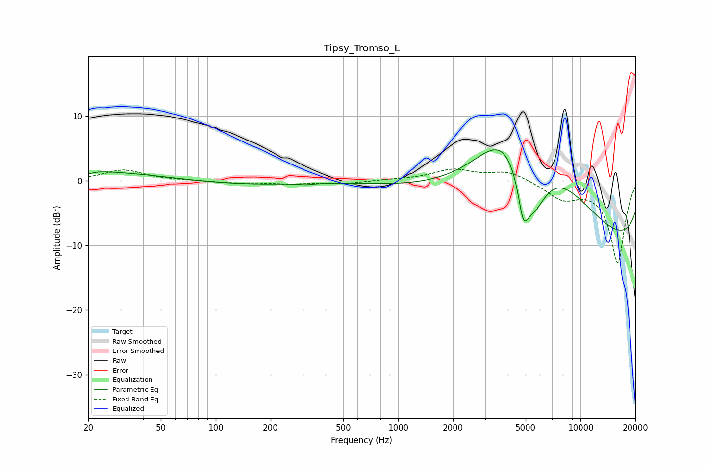

# Tipsy_Tromso_L
See [usage instructions](https://github.com/jaakkopasanen/AutoEq#usage) for more options and info.

### Parametric EQs
Apply preamp of -4.9 dB when using parametric equalizer.

|   # | Type    |   Fc (Hz) |    Q |   Gain (dB) |
|-----|---------|-----------|------|-------------|
|   1 | Peaking |        20 | 5.88 |        -0.5 |
|   2 | Peaking |        22 | 0.2  |         1.9 |
|   3 | Peaking |        96 | 0.39 |        -1.2 |
|   4 | Peaking |       311 | 5.01 |        -0.2 |
|   5 | Peaking |       488 | 4.67 |         0   |
|   6 | Peaking |      3833 | 0.88 |         9.1 |
|   7 | Peaking |      4854 | 5.06 |        -5.5 |
|   8 | Peaking |      5461 | 1.59 |        -9.9 |
|   9 | Peaking |      6853 | 0.39 |        15.4 |
|  10 | Peaking |     10000 | 0.18 |       -15.6 |

### Fixed Band EQs
When using fixed band (also called graphic) equalizer, apply preamp of **-1.9 dB** (if available) and set gains manually with these parameters.

|   # | Type    |   Fc (Hz) |    Q |   Gain (dB) |
|-----|---------|-----------|------|-------------|
|   1 | Peaking |        31 | 1.41 |         1.7 |
|   2 | Peaking |        62 | 1.41 |         0   |
|   3 | Peaking |       125 | 1.41 |        -0.3 |
|   4 | Peaking |       250 | 1.41 |        -0.4 |
|   5 | Peaking |       500 | 1.41 |        -0.4 |
|   6 | Peaking |      1000 | 1.41 |         0.2 |
|   7 | Peaking |      2000 | 1.41 |         1.6 |
|   8 | Peaking |      4000 | 1.41 |         1.5 |
|   9 | Peaking |      8000 | 1.41 |        -2.5 |
|  10 | Peaking |     16000 | 1.41 |       -12.7 |

### Graphs

