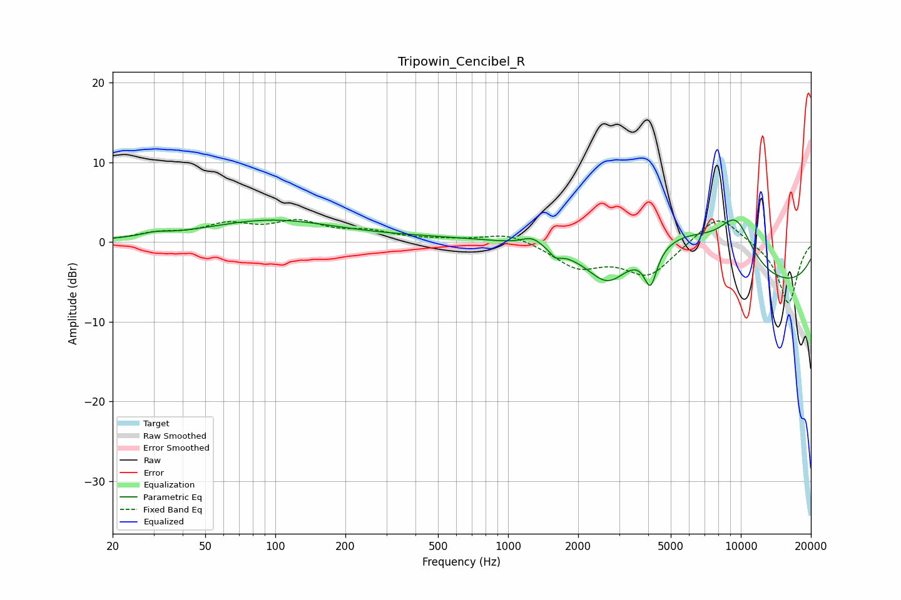

# Tripowin_Cencibel_R
See [usage instructions](https://github.com/jaakkopasanen/AutoEq#usage) for more options and info.

### Parametric EQs
Apply preamp of -2.9 dB when using parametric equalizer.

|   # | Type    |   Fc (Hz) |    Q |   Gain (dB) |
|-----|---------|-----------|------|-------------|
|   1 | Peaking |        30 | 2.59 |         0.4 |
|   2 | Peaking |        95 | 0.51 |         2.7 |
|   3 | Peaking |      1246 | 0.21 |         0.8 |
|   4 | Peaking |      1270 | 3.13 |         1.2 |
|   5 | Peaking |      1597 | 6    |        -0.9 |
|   6 | Peaking |      2674 | 1.7  |        -3.8 |
|   7 | Peaking |      4093 | 5.17 |        -4.5 |
|   8 | Peaking |      5877 | 0.66 |         5.8 |
|   9 | Peaking |      9538 | 1.7  |         5.6 |
|  10 | Peaking |     10000 | 0.18 |        -6.3 |

### Fixed Band EQs
When using fixed band (also called graphic) equalizer, apply preamp of **-2.9 dB** (if available) and set gains manually with these parameters.

|   # | Type    |   Fc (Hz) |    Q |   Gain (dB) |
|-----|---------|-----------|------|-------------|
|   1 | Peaking |        31 | 1.41 |         0.9 |
|   2 | Peaking |        62 | 1.41 |         1.9 |
|   3 | Peaking |       125 | 1.41 |         2.2 |
|   4 | Peaking |       250 | 1.41 |         1.1 |
|   5 | Peaking |       500 | 1.41 |         0.2 |
|   6 | Peaking |      1000 | 1.41 |         1.2 |
|   7 | Peaking |      2000 | 1.41 |        -3   |
|   8 | Peaking |      4000 | 1.41 |        -4.1 |
|   9 | Peaking |      8000 | 1.41 |         3.8 |
|  10 | Peaking |     16000 | 1.41 |        -7.8 |

### Graphs

