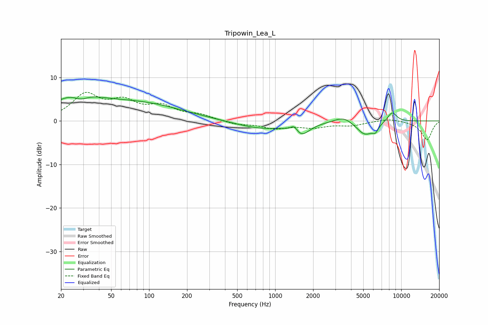

# Tripowin_Lea_L
See [usage instructions](https://github.com/jaakkopasanen/AutoEq#usage) for more options and info.

### Parametric EQs
Apply preamp of -5.6 dB when using parametric equalizer.

|   # | Type    |   Fc (Hz) |    Q |   Gain (dB) |
|-----|---------|-----------|------|-------------|
|   1 | Peaking |        26 | 0.77 |         5   |
|   2 | Peaking |        29 | 2.5  |        -1.5 |
|   3 | Peaking |        85 | 0.41 |         3.8 |
|   4 | Peaking |       776 | 0.69 |        -1.8 |
|   5 | Peaking |      1415 | 5.09 |         1.5 |
|   6 | Peaking |      1612 | 2.27 |        -2.7 |
|   7 | Peaking |      3487 | 1.93 |         1.5 |
|   8 | Peaking |      5162 | 2.02 |        -3.2 |
|   9 | Peaking |      6239 | 5.99 |        -1.4 |
|  10 | Peaking |      8462 | 3.47 |         2.3 |

### Fixed Band EQs
When using fixed band (also called graphic) equalizer, apply preamp of **-6.7 dB** (if available) and set gains manually with these parameters.

|   # | Type    |   Fc (Hz) |    Q |   Gain (dB) |
|-----|---------|-----------|------|-------------|
|   1 | Peaking |        31 | 1.41 |         5.7 |
|   2 | Peaking |        62 | 1.41 |         3.8 |
|   3 | Peaking |       125 | 1.41 |         2.9 |
|   4 | Peaking |       250 | 1.41 |         1.2 |
|   5 | Peaking |       500 | 1.41 |        -0.8 |
|   6 | Peaking |      1000 | 1.41 |        -1.5 |
|   7 | Peaking |      2000 | 1.41 |        -1.3 |
|   8 | Peaking |      4000 | 1.41 |        -0.9 |
|   9 | Peaking |      8000 | 1.41 |         0.6 |
|  10 | Peaking |     16000 | 1.41 |        -4.3 |

### Graphs

