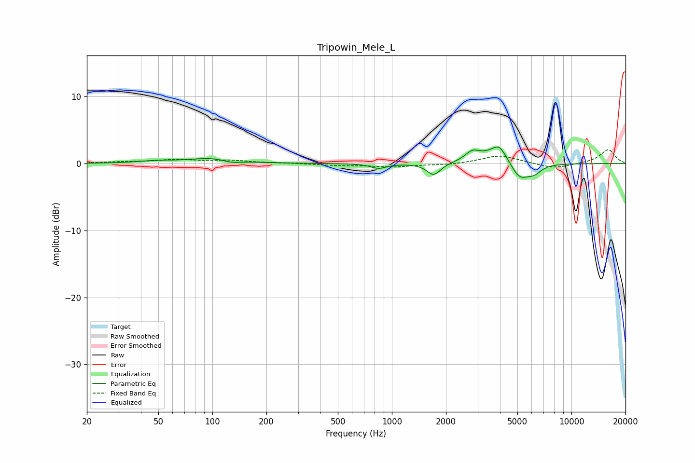

# Tripowin_Mele_L
See [usage instructions](https://github.com/jaakkopasanen/AutoEq#usage) for more options and info.

### Parametric EQs
Apply preamp of -2.6 dB when using parametric equalizer.

|   # | Type    |   Fc (Hz) |    Q |   Gain (dB) |
|-----|---------|-----------|------|-------------|
|   1 | Peaking |        48 | 1.47 |         0.3 |
|   2 | Peaking |       102 | 1.11 |         0.9 |
|   3 | Peaking |       127 | 2.48 |        -0.5 |
|   4 | Peaking |       843 | 3.3  |        -0.7 |
|   5 | Peaking |      1709 | 3.72 |        -1.8 |
|   6 | Peaking |      2808 | 3.52 |         1.3 |
|   7 | Peaking |      3948 | 1.7  |         2.4 |
|   8 | Peaking |      3959 | 4.73 |         1   |
|   9 | Peaking |      5126 | 2.48 |        -3   |
|  10 | Peaking |      6229 | 3.56 |        -1   |

### Fixed Band EQs
When using fixed band (also called graphic) equalizer, apply preamp of **-2.2 dB** (if available) and set gains manually with these parameters.

|   # | Type    |   Fc (Hz) |    Q |   Gain (dB) |
|-----|---------|-----------|------|-------------|
|   1 | Peaking |        31 | 1.41 |         0.2 |
|   2 | Peaking |        62 | 1.41 |         0.5 |
|   3 | Peaking |       125 | 1.41 |         0.4 |
|   4 | Peaking |       250 | 1.41 |         0.1 |
|   5 | Peaking |       500 | 1.41 |        -0.3 |
|   6 | Peaking |      1000 | 1.41 |        -0.5 |
|   7 | Peaking |      2000 | 1.41 |        -0.2 |
|   8 | Peaking |      4000 | 1.41 |         1.3 |
|   9 | Peaking |      8000 | 1.41 |        -0.8 |
|  10 | Peaking |     16000 | 1.41 |         2.1 |

### Graphs

