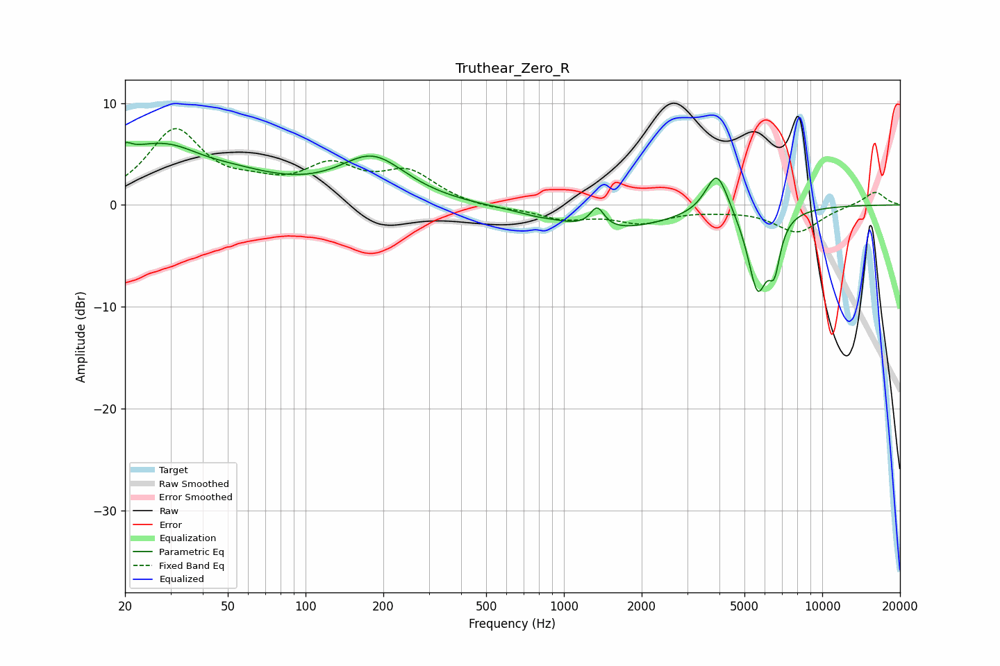

# Truthear_Zero_R
See [usage instructions](https://github.com/jaakkopasanen/AutoEq#usage) for more options and info.

### Parametric EQs
Apply preamp of -6.2 dB when using parametric equalizer.

|   # | Type    |   Fc (Hz) |    Q |   Gain (dB) |
|-----|---------|-----------|------|-------------|
|   1 | Peaking |        20 | 5.85 |         1   |
|   2 | Peaking |        30 | 0.56 |         6.5 |
|   3 | Peaking |        40 | 1.24 |        -1.1 |
|   4 | Peaking |       182 | 1.09 |         4.3 |
|   5 | Peaking |       770 | 2.92 |        -0.1 |
|   6 | Peaking |      1345 | 5.29 |         2   |
|   7 | Peaking |      1517 | 0.64 |        -2.4 |
|   8 | Peaking |      3913 | 3.19 |         4.4 |
|   9 | Peaking |      5621 | 3.51 |        -7.9 |
|  10 | Peaking |      6529 | 6    |        -4   |

### Fixed Band EQs
When using fixed band (also called graphic) equalizer, apply preamp of **-7.6 dB** (if available) and set gains manually with these parameters.

|   # | Type    |   Fc (Hz) |    Q |   Gain (dB) |
|-----|---------|-----------|------|-------------|
|   1 | Peaking |        31 | 1.41 |         7.1 |
|   2 | Peaking |        62 | 1.41 |         1.2 |
|   3 | Peaking |       125 | 1.41 |         3.3 |
|   4 | Peaking |       250 | 1.41 |         2.9 |
|   5 | Peaking |       500 | 1.41 |        -0.4 |
|   6 | Peaking |      1000 | 1.41 |        -1.2 |
|   7 | Peaking |      2000 | 1.41 |        -1.6 |
|   8 | Peaking |      4000 | 1.41 |        -0.3 |
|   9 | Peaking |      8000 | 1.41 |        -2.6 |
|  10 | Peaking |     16000 | 1.41 |         1.4 |

### Graphs

