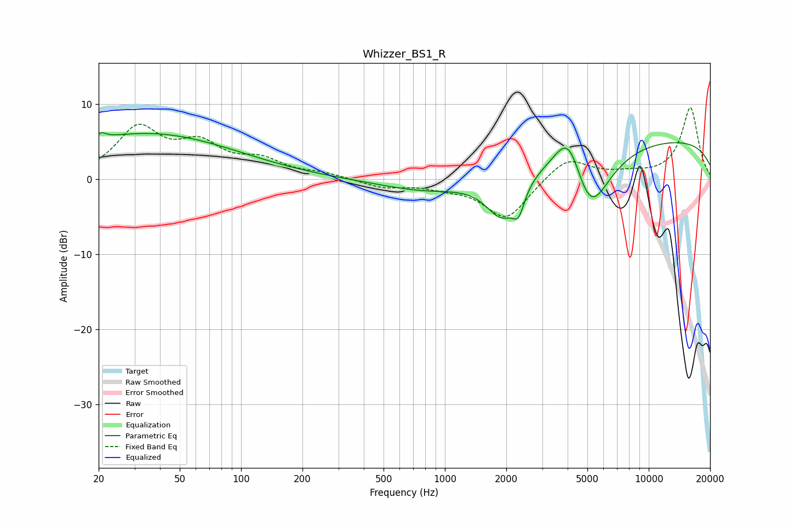

# Whizzer_BS1_R
See [usage instructions](https://github.com/jaakkopasanen/AutoEq#usage) for more options and info.

### Parametric EQs
Apply preamp of -6.3 dB when using parametric equalizer.

|   # | Type    |   Fc (Hz) |    Q |   Gain (dB) |
|-----|---------|-----------|------|-------------|
|   1 | Peaking |        20 | 5.49 |        -2.6 |
|   2 | Peaking |        20 | 5.65 |         3.3 |
|   3 | Peaking |        31 | 0.56 |         0.2 |
|   4 | Peaking |        35 | 0.31 |         5.9 |
|   5 | Peaking |       833 | 0.62 |        -1.7 |
|   6 | Peaking |      1908 | 1.71 |        -5.9 |
|   7 | Peaking |      2299 | 4.94 |        -3   |
|   8 | Peaking |      4048 | 2    |         6.6 |
|   9 | Peaking |      5134 | 1.41 |        -9.7 |
|  10 | Peaking |     10000 | 0.18 |         5.5 |

### Fixed Band EQs
When using fixed band (also called graphic) equalizer, apply preamp of **-9.6 dB** (if available) and set gains manually with these parameters.

|   # | Type    |   Fc (Hz) |    Q |   Gain (dB) |
|-----|---------|-----------|------|-------------|
|   1 | Peaking |        31 | 1.41 |         6.5 |
|   2 | Peaking |        62 | 1.41 |         4   |
|   3 | Peaking |       125 | 1.41 |         2.2 |
|   4 | Peaking |       250 | 1.41 |         0.6 |
|   5 | Peaking |       500 | 1.41 |        -1.1 |
|   6 | Peaking |      1000 | 1.41 |        -0.8 |
|   7 | Peaking |      2000 | 1.41 |        -5.3 |
|   8 | Peaking |      4000 | 1.41 |         3   |
|   9 | Peaking |      8000 | 1.41 |         0.6 |
|  10 | Peaking |     16000 | 1.41 |         9.5 |

### Graphs

