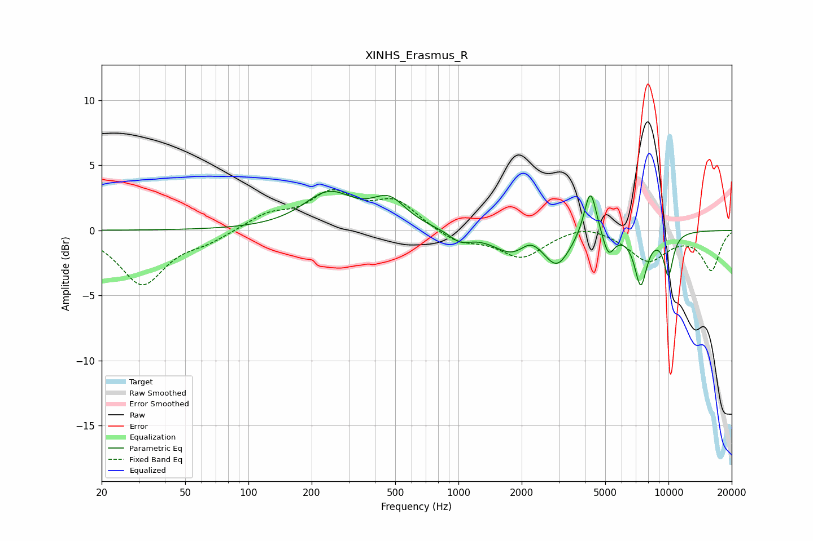

# XINHS_Erasmus_R
See [usage instructions](https://github.com/jaakkopasanen/AutoEq#usage) for more options and info.

### Parametric EQs
Apply preamp of -3.1 dB when using parametric equalizer.

|   # | Type    |   Fc (Hz) |    Q |   Gain (dB) |
|-----|---------|-----------|------|-------------|
|   1 | Peaking |       241 | 1.18 |         2.7 |
|   2 | Peaking |       467 | 1.74 |         2   |
|   3 | Peaking |      1020 | 2.76 |        -0.8 |
|   4 | Peaking |      1827 | 1.51 |        -1.8 |
|   5 | Peaking |      2198 | 2.64 |         1   |
|   6 | Peaking |      2947 | 2.25 |        -2.5 |
|   7 | Peaking |      4249 | 4.74 |         3.8 |
|   8 | Peaking |      5179 | 5.03 |        -1.8 |
|   9 | Peaking |      7379 | 4.55 |        -3.9 |
|  10 | Peaking |     10000 | 5.45 |        -3.2 |

### Fixed Band EQs
When using fixed band (also called graphic) equalizer, apply preamp of **-3.2 dB** (if available) and set gains manually with these parameters.

|   # | Type    |   Fc (Hz) |    Q |   Gain (dB) |
|-----|---------|-----------|------|-------------|
|   1 | Peaking |        31 | 1.41 |        -4.1 |
|   2 | Peaking |        62 | 1.41 |        -0.7 |
|   3 | Peaking |       125 | 1.41 |         1.1 |
|   4 | Peaking |       250 | 1.41 |         2.6 |
|   5 | Peaking |       500 | 1.41 |         2.1 |
|   6 | Peaking |      1000 | 1.41 |        -0.9 |
|   7 | Peaking |      2000 | 1.41 |        -2   |
|   8 | Peaking |      4000 | 1.41 |         0.6 |
|   9 | Peaking |      8000 | 1.41 |        -2.3 |
|  10 | Peaking |     16000 | 1.41 |        -3   |

### Graphs

