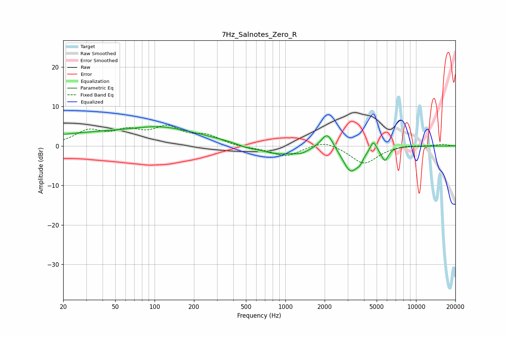

# 7Hz_Salnotes_Zero_R
See [usage instructions](https://github.com/jaakkopasanen/AutoEq#usage) for more options and info.

### Parametric EQs
Apply preamp of -4.9 dB when using parametric equalizer.

|   # | Type    |   Fc (Hz) |    Q |   Gain (dB) |
|-----|---------|-----------|------|-------------|
|   1 | Peaking |        60 | 0.18 |         3.5 |
|   2 | Peaking |       112 | 0.72 |         1.6 |
|   3 | Peaking |       498 | 2.07 |        -0.6 |
|   4 | Peaking |       881 | 0.94 |        -2.3 |
|   5 | Peaking |      1330 | 2.79 |        -0.8 |
|   6 | Peaking |      2094 | 3.02 |         4.4 |
|   7 | Peaking |      3160 | 2.33 |        -6.5 |
|   8 | Peaking |      3722 | 5.96 |        -1.4 |
|   9 | Peaking |      4703 | 6    |         2.7 |
|  10 | Peaking |      5774 | 5.17 |        -3.3 |

### Fixed Band EQs
When using fixed band (also called graphic) equalizer, apply preamp of **-5.3 dB** (if available) and set gains manually with these parameters.

|   # | Type    |   Fc (Hz) |    Q |   Gain (dB) |
|-----|---------|-----------|------|-------------|
|   1 | Peaking |        31 | 1.41 |         3.5 |
|   2 | Peaking |        62 | 1.41 |         3.1 |
|   3 | Peaking |       125 | 1.41 |         4.2 |
|   4 | Peaking |       250 | 1.41 |         2.3 |
|   5 | Peaking |       500 | 1.41 |        -0.5 |
|   6 | Peaking |      1000 | 1.41 |        -2.6 |
|   7 | Peaking |      2000 | 1.41 |         1.6 |
|   8 | Peaking |      4000 | 1.41 |        -4.6 |
|   9 | Peaking |      8000 | 1.41 |         0.4 |
|  10 | Peaking |     16000 | 1.41 |         0.4 |

### Graphs

