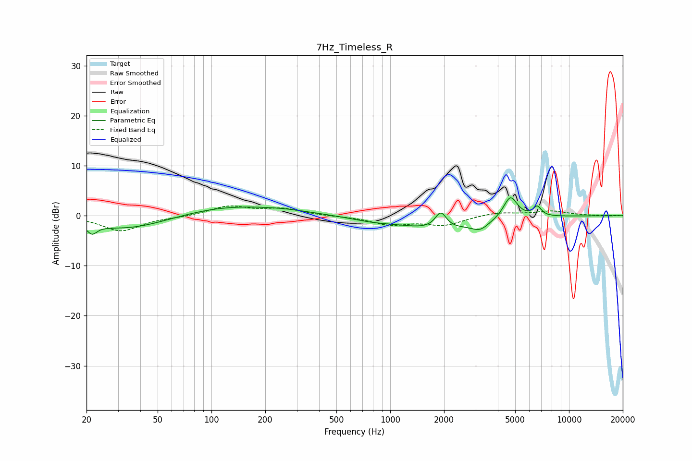

# 7Hz_Timeless_R
See [usage instructions](https://github.com/jaakkopasanen/AutoEq#usage) for more options and info.

### Parametric EQs
Apply preamp of -3.7 dB when using parametric equalizer.

|   # | Type    |   Fc (Hz) |    Q |   Gain (dB) |
|-----|---------|-----------|------|-------------|
|   1 | Peaking |        21 | 5.26 |        -1.8 |
|   2 | Peaking |        35 | 0.6  |        -2.9 |
|   3 | Peaking |       123 | 0.47 |         2.1 |
|   4 | Peaking |       264 | 1    |         0.3 |
|   5 | Peaking |       783 | 1.22 |        -0.6 |
|   6 | Peaking |      1906 | 0.64 |        -2.7 |
|   7 | Peaking |      1918 | 4.52 |         3.3 |
|   8 | Peaking |      3189 | 3.04 |        -1.5 |
|   9 | Peaking |      4700 | 3.57 |         4.6 |
|  10 | Peaking |      6646 | 5.97 |         1.9 |

### Fixed Band EQs
When using fixed band (also called graphic) equalizer, apply preamp of **-2.1 dB** (if available) and set gains manually with these parameters.

|   # | Type    |   Fc (Hz) |    Q |   Gain (dB) |
|-----|---------|-----------|------|-------------|
|   1 | Peaking |        31 | 1.41 |        -3   |
|   2 | Peaking |        62 | 1.41 |        -0.2 |
|   3 | Peaking |       125 | 1.41 |         1.9 |
|   4 | Peaking |       250 | 1.41 |         1.3 |
|   5 | Peaking |       500 | 1.41 |        -0.1 |
|   6 | Peaking |      1000 | 1.41 |        -1.7 |
|   7 | Peaking |      2000 | 1.41 |        -1.8 |
|   8 | Peaking |      4000 | 1.41 |         0.7 |
|   9 | Peaking |      8000 | 1.41 |         0.9 |
|  10 | Peaking |     16000 | 1.41 |        -0   |

### Graphs

