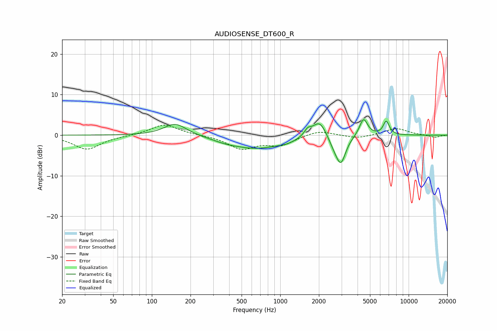

# AUDIOSENSE_DT600_R
See [usage instructions](https://github.com/jaakkopasanen/AutoEq#usage) for more options and info.

### Parametric EQs
Apply preamp of -3.9 dB when using parametric equalizer.

|   # | Type    |   Fc (Hz) |    Q |   Gain (dB) |
|-----|---------|-----------|------|-------------|
|   1 | Peaking |       152 | 1.61 |         3   |
|   2 | Peaking |       375 | 1.4  |        -0.6 |
|   3 | Peaking |       652 | 0.72 |        -3.1 |
|   4 | Peaking |      1123 | 2.03 |        -0.7 |
|   5 | Peaking |      1635 | 5.45 |         1.5 |
|   6 | Peaking |      2026 | 2.5  |         4.4 |
|   7 | Peaking |      2637 | 2.94 |        -2.2 |
|   8 | Peaking |      2970 | 3.71 |        -6.2 |
|   9 | Peaking |      4455 | 4.4  |         4.4 |
|  10 | Peaking |      6692 | 5.71 |         3.4 |

### Fixed Band EQs
When using fixed band (also called graphic) equalizer, apply preamp of **-2.6 dB** (if available) and set gains manually with these parameters.

|   # | Type    |   Fc (Hz) |    Q |   Gain (dB) |
|-----|---------|-----------|------|-------------|
|   1 | Peaking |        31 | 1.41 |        -3.5 |
|   2 | Peaking |        62 | 1.41 |        -0.1 |
|   3 | Peaking |       125 | 1.41 |         2.7 |
|   4 | Peaking |       250 | 1.41 |         0   |
|   5 | Peaking |       500 | 1.41 |        -3.2 |
|   6 | Peaking |      1000 | 1.41 |        -2.3 |
|   7 | Peaking |      2000 | 1.41 |         1.3 |
|   8 | Peaking |      4000 | 1.41 |        -0.8 |
|   9 | Peaking |      8000 | 1.41 |         1.7 |
|  10 | Peaking |     16000 | 1.41 |        -0.6 |

### Graphs

