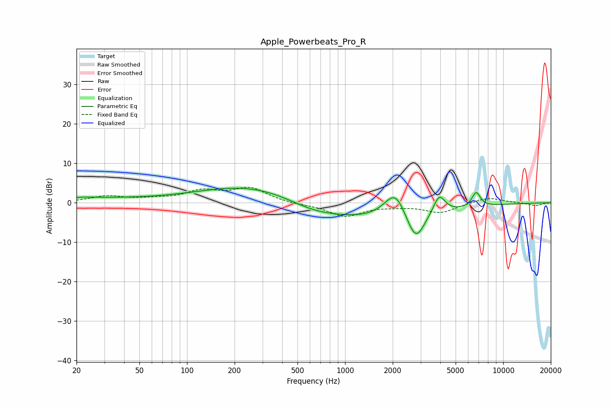

# Apple_Powerbeats_Pro_R
See [usage instructions](https://github.com/jaakkopasanen/AutoEq#usage) for more options and info.

### Parametric EQs
Apply preamp of -3.8 dB when using parametric equalizer.

|   # | Type    |   Fc (Hz) |    Q |   Gain (dB) |
|-----|---------|-----------|------|-------------|
|   1 | Peaking |        22 | 1.63 |         0.6 |
|   2 | Peaking |        35 | 0.53 |         0.8 |
|   3 | Peaking |       288 | 0.4  |         5.4 |
|   4 | Peaking |       607 | 0.96 |        -1.4 |
|   5 | Peaking |      1288 | 0.3  |        -5   |
|   6 | Peaking |      2075 | 2    |         7.3 |
|   7 | Peaking |      2607 | 2.86 |        -1.5 |
|   8 | Peaking |      2833 | 2.67 |        -6.4 |
|   9 | Peaking |      3936 | 3.78 |         4.9 |
|  10 | Peaking |      6747 | 5.05 |         3.8 |

### Fixed Band EQs
When using fixed band (also called graphic) equalizer, apply preamp of **-4.0 dB** (if available) and set gains manually with these parameters.

|   # | Type    |   Fc (Hz) |    Q |   Gain (dB) |
|-----|---------|-----------|------|-------------|
|   1 | Peaking |        31 | 1.41 |         1.6 |
|   2 | Peaking |        62 | 1.41 |         0.7 |
|   3 | Peaking |       125 | 1.41 |         2.7 |
|   4 | Peaking |       250 | 1.41 |         3.6 |
|   5 | Peaking |       500 | 1.41 |        -0.4 |
|   6 | Peaking |      1000 | 1.41 |        -3.4 |
|   7 | Peaking |      2000 | 1.41 |        -0.6 |
|   8 | Peaking |      4000 | 1.41 |        -2.5 |
|   9 | Peaking |      8000 | 1.41 |         1.5 |
|  10 | Peaking |     16000 | 1.41 |        -0.8 |

### Graphs

