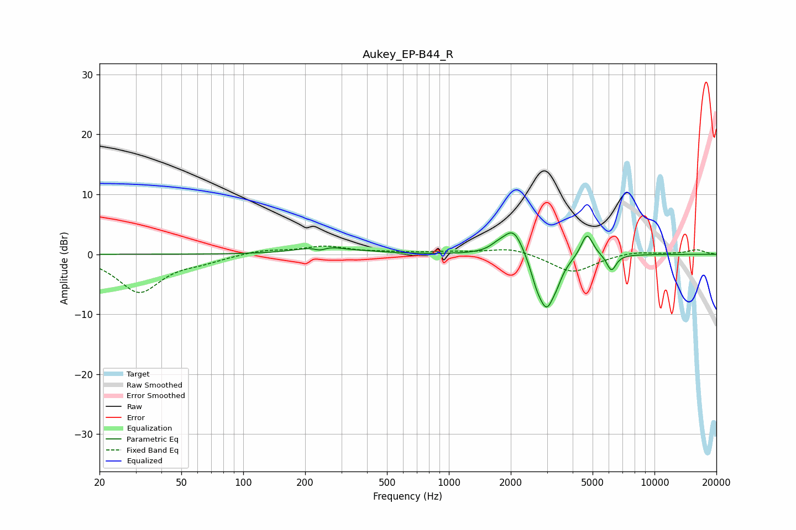

# Aukey_EP-B44_R
See [usage instructions](https://github.com/jaakkopasanen/AutoEq#usage) for more options and info.

### Parametric EQs
Apply preamp of -3.7 dB when using parametric equalizer.

|   # | Type    |   Fc (Hz) |    Q |   Gain (dB) |
|-----|---------|-----------|------|-------------|
|   1 | Peaking |       236 | 4.95 |        -0.7 |
|   2 | Peaking |       242 | 1.36 |         1.4 |
|   3 | Peaking |       423 | 1.82 |         0.2 |
|   4 | Peaking |      1725 | 3.92 |         0.7 |
|   5 | Peaking |      2063 | 2.78 |         4.7 |
|   6 | Peaking |      2673 | 4.96 |        -2.1 |
|   7 | Peaking |      2992 | 3.24 |        -8.6 |
|   8 | Peaking |      3360 | 6    |        -1   |
|   9 | Peaking |      4696 | 4.8  |         4   |
|  10 | Peaking |      6172 | 6    |        -2.8 |

### Fixed Band EQs
When using fixed band (also called graphic) equalizer, apply preamp of **-1.5 dB** (if available) and set gains manually with these parameters.

|   # | Type    |   Fc (Hz) |    Q |   Gain (dB) |
|-----|---------|-----------|------|-------------|
|   1 | Peaking |        31 | 1.41 |        -6.2 |
|   2 | Peaking |        62 | 1.41 |        -0.9 |
|   3 | Peaking |       125 | 1.41 |         0.7 |
|   4 | Peaking |       250 | 1.41 |         1.3 |
|   5 | Peaking |       500 | 1.41 |         0.2 |
|   6 | Peaking |      1000 | 1.41 |         0.3 |
|   7 | Peaking |      2000 | 1.41 |         1.1 |
|   8 | Peaking |      4000 | 1.41 |        -3.1 |
|   9 | Peaking |      8000 | 1.41 |         0.5 |
|  10 | Peaking |     16000 | 1.41 |         0.7 |

### Graphs

