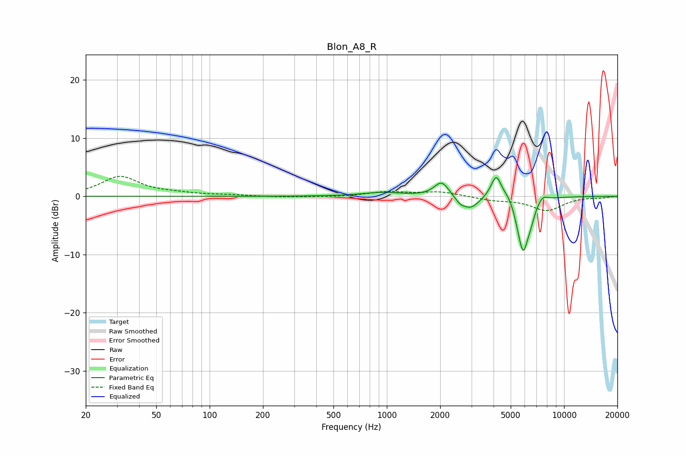

# Blon_A8_R
See [usage instructions](https://github.com/jaakkopasanen/AutoEq#usage) for more options and info.

### Parametric EQs
Apply preamp of -3.3 dB when using parametric equalizer.

|   # | Type    |   Fc (Hz) |    Q |   Gain (dB) |
|-----|---------|-----------|------|-------------|
|   1 | Peaking |       941 | 1.3  |         0.7 |
|   2 | Peaking |      2038 | 3.46 |         2.6 |
|   3 | Peaking |      2595 | 4.94 |        -0.9 |
|   4 | Peaking |      2981 | 2.97 |        -2.1 |
|   5 | Peaking |      4141 | 4.76 |         4.1 |
|   6 | Peaking |      4876 | 4.37 |         1   |
|   7 | Peaking |      5480 | 6    |        -0.9 |
|   8 | Peaking |      5884 | 4.63 |        -8.8 |
|   9 | Peaking |      6487 | 6    |        -1.8 |
|  10 | Peaking |      7600 | 4.97 |         1   |

### Fixed Band EQs
When using fixed band (also called graphic) equalizer, apply preamp of **-3.5 dB** (if available) and set gains manually with these parameters.

|   # | Type    |   Fc (Hz) |    Q |   Gain (dB) |
|-----|---------|-----------|------|-------------|
|   1 | Peaking |        31 | 1.41 |         3.4 |
|   2 | Peaking |        62 | 1.41 |         0.4 |
|   3 | Peaking |       125 | 1.41 |         0.2 |
|   4 | Peaking |       250 | 1.41 |        -0.1 |
|   5 | Peaking |       500 | 1.41 |        -0.1 |
|   6 | Peaking |      1000 | 1.41 |         0.7 |
|   7 | Peaking |      2000 | 1.41 |         0.8 |
|   8 | Peaking |      4000 | 1.41 |        -0.6 |
|   9 | Peaking |      8000 | 1.41 |        -2.4 |
|  10 | Peaking |     16000 | 1.41 |        -0.2 |

### Graphs

