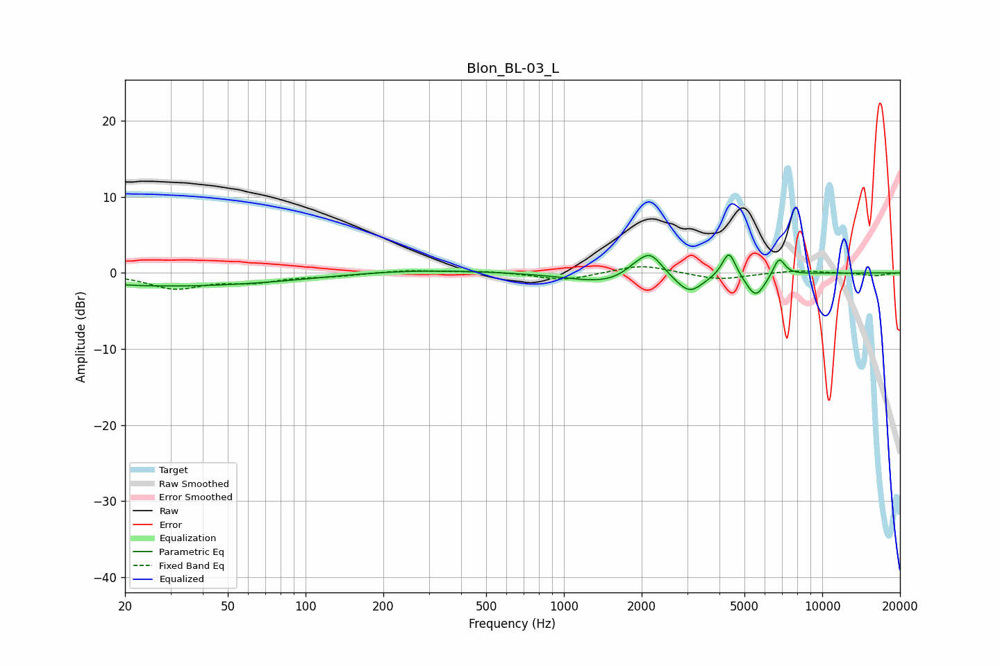

# Blon_BL-03_L
See [usage instructions](https://github.com/jaakkopasanen/AutoEq#usage) for more options and info.

### Parametric EQs
Apply preamp of -2.5 dB when using parametric equalizer.

|   # | Type    |   Fc (Hz) |    Q |   Gain (dB) |
|-----|---------|-----------|------|-------------|
|   1 | Peaking |        20 | 0.66 |        -0.3 |
|   2 | Peaking |        39 | 0.34 |        -1.5 |
|   3 | Peaking |       255 | 0.51 |         0.5 |
|   4 | Peaking |      1466 | 1    |        -1.4 |
|   5 | Peaking |      1891 | 2.85 |         1.1 |
|   6 | Peaking |      2167 | 3.12 |         2.9 |
|   7 | Peaking |      3067 | 2.74 |        -2.5 |
|   8 | Peaking |      4354 | 5.45 |         3.4 |
|   9 | Peaking |      5529 | 3.74 |        -3.1 |
|  10 | Peaking |      6804 | 6    |         2.4 |

### Fixed Band EQs
When using fixed band (also called graphic) equalizer, apply preamp of **-0.9 dB** (if available) and set gains manually with these parameters.

|   # | Type    |   Fc (Hz) |    Q |   Gain (dB) |
|-----|---------|-----------|------|-------------|
|   1 | Peaking |        31 | 1.41 |        -2   |
|   2 | Peaking |        62 | 1.41 |        -1   |
|   3 | Peaking |       125 | 1.41 |        -0.4 |
|   4 | Peaking |       250 | 1.41 |         0.4 |
|   5 | Peaking |       500 | 1.41 |         0.2 |
|   6 | Peaking |      1000 | 1.41 |        -1   |
|   7 | Peaking |      2000 | 1.41 |         1.1 |
|   8 | Peaking |      4000 | 1.41 |        -0.9 |
|   9 | Peaking |      8000 | 1.41 |         0.3 |
|  10 | Peaking |     16000 | 1.41 |        -0.4 |

### Graphs

