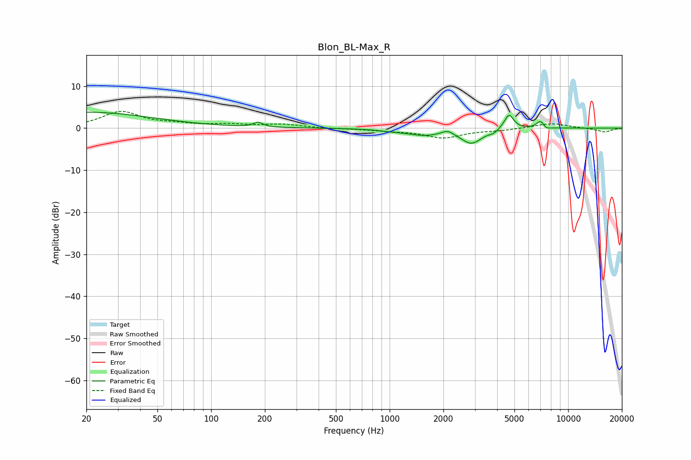

# Blon_BL-Max_R
See [usage instructions](https://github.com/jaakkopasanen/AutoEq#usage) for more options and info.

### Parametric EQs
Apply preamp of -3.9 dB when using parametric equalizer.

|   # | Type    |   Fc (Hz) |    Q |   Gain (dB) |
|-----|---------|-----------|------|-------------|
|   1 | Peaking |        20 | 0.38 |         3.8 |
|   2 | Peaking |       183 | 5.6  |         1.1 |
|   3 | Peaking |      1052 | 1.63 |        -0.4 |
|   4 | Peaking |      1565 | 1.6  |        -1.4 |
|   5 | Peaking |      2111 | 4.64 |         1   |
|   6 | Peaking |      2871 | 2.41 |        -3.5 |
|   7 | Peaking |      3815 | 6    |        -0.6 |
|   8 | Peaking |      4662 | 5.34 |         3.6 |
|   9 | Peaking |      7040 | 5.78 |         2.2 |
|  10 | Peaking |      7423 | 5.95 |        -1   |

### Fixed Band EQs
When using fixed band (also called graphic) equalizer, apply preamp of **-4.1 dB** (if available) and set gains manually with these parameters.

|   # | Type    |   Fc (Hz) |    Q |   Gain (dB) |
|-----|---------|-----------|------|-------------|
|   1 | Peaking |        31 | 1.41 |         3.8 |
|   2 | Peaking |        62 | 1.41 |         0.7 |
|   3 | Peaking |       125 | 1.41 |         0.7 |
|   4 | Peaking |       250 | 1.41 |         0.8 |
|   5 | Peaking |       500 | 1.41 |        -0.1 |
|   6 | Peaking |      1000 | 1.41 |        -0.5 |
|   7 | Peaking |      2000 | 1.41 |        -2.2 |
|   8 | Peaking |      4000 | 1.41 |        -0.4 |
|   9 | Peaking |      8000 | 1.41 |         1.2 |
|  10 | Peaking |     16000 | 1.41 |        -0.9 |

### Graphs

