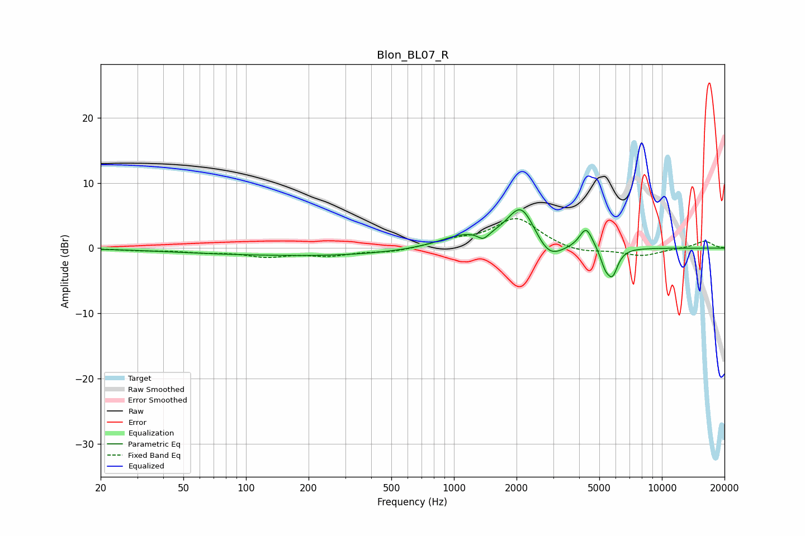

# Blon_BL07_R
See [usage instructions](https://github.com/jaakkopasanen/AutoEq#usage) for more options and info.

### Parametric EQs
Apply preamp of -6.0 dB when using parametric equalizer.

|   # | Type    |   Fc (Hz) |    Q |   Gain (dB) |
|-----|---------|-----------|------|-------------|
|   1 | Peaking |        63 | 0.52 |        -0.4 |
|   2 | Peaking |       247 | 0.37 |        -1.1 |
|   3 | Peaking |      1027 | 1.04 |         0.3 |
|   4 | Peaking |      1137 | 1.2  |         1.6 |
|   5 | Peaking |      1383 | 5.36 |        -1.2 |
|   6 | Peaking |      2107 | 2.04 |         6.4 |
|   7 | Peaking |      2859 | 2.19 |        -3   |
|   8 | Peaking |      4323 | 4.41 |         3.3 |
|   9 | Peaking |      5335 | 6    |        -2.2 |
|  10 | Peaking |      5787 | 5.27 |        -3.8 |

### Fixed Band EQs
When using fixed band (also called graphic) equalizer, apply preamp of **-4.6 dB** (if available) and set gains manually with these parameters.

|   # | Type    |   Fc (Hz) |    Q |   Gain (dB) |
|-----|---------|-----------|------|-------------|
|   1 | Peaking |        31 | 1.41 |        -0.3 |
|   2 | Peaking |        62 | 1.41 |        -0.5 |
|   3 | Peaking |       125 | 1.41 |        -1.1 |
|   4 | Peaking |       250 | 1.41 |        -1   |
|   5 | Peaking |       500 | 1.41 |        -0.6 |
|   6 | Peaking |      1000 | 1.41 |         1   |
|   7 | Peaking |      2000 | 1.41 |         4.5 |
|   8 | Peaking |      4000 | 1.41 |        -0.8 |
|   9 | Peaking |      8000 | 1.41 |        -1.2 |
|  10 | Peaking |     16000 | 1.41 |         1.1 |

### Graphs

