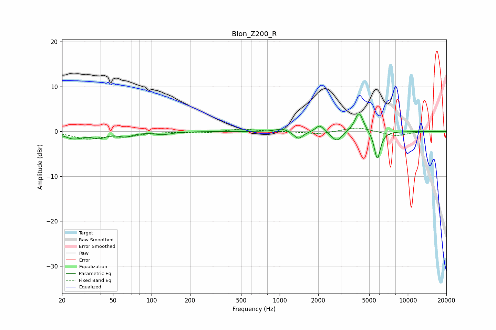

# Blon_Z200_R
See [usage instructions](https://github.com/jaakkopasanen/AutoEq#usage) for more options and info.

### Parametric EQs
Apply preamp of -4.0 dB when using parametric equalizer.

|   # | Type    |   Fc (Hz) |    Q |   Gain (dB) |
|-----|---------|-----------|------|-------------|
|   1 | Peaking |        25 | 2.03 |        -1.5 |
|   2 | Peaking |        39 | 2.68 |        -1.2 |
|   3 | Peaking |        63 | 2.54 |        -1   |
|   4 | Peaking |       123 | 2.24 |        -0.6 |
|   5 | Peaking |      1043 | 2.98 |         0.7 |
|   6 | Peaking |      1401 | 4.07 |        -1.7 |
|   7 | Peaking |      2053 | 4.56 |         1.6 |
|   8 | Peaking |      2792 | 3.47 |        -2.3 |
|   9 | Peaking |      4163 | 4.22 |         4.5 |
|  10 | Peaking |      5782 | 5.76 |        -6.4 |

### Fixed Band EQs
When using fixed band (also called graphic) equalizer, apply preamp of **-0.8 dB** (if available) and set gains manually with these parameters.

|   # | Type    |   Fc (Hz) |    Q |   Gain (dB) |
|-----|---------|-----------|------|-------------|
|   1 | Peaking |        31 | 1.41 |        -1.5 |
|   2 | Peaking |        62 | 1.41 |        -1   |
|   3 | Peaking |       125 | 1.41 |        -0   |
|   4 | Peaking |       250 | 1.41 |        -0.4 |
|   5 | Peaking |       500 | 1.41 |         0.6 |
|   6 | Peaking |      1000 | 1.41 |        -0   |
|   7 | Peaking |      2000 | 1.41 |        -0.6 |
|   8 | Peaking |      4000 | 1.41 |         1   |
|   9 | Peaking |      8000 | 1.41 |        -1   |
|  10 | Peaking |     16000 | 1.41 |         0.1 |

### Graphs

