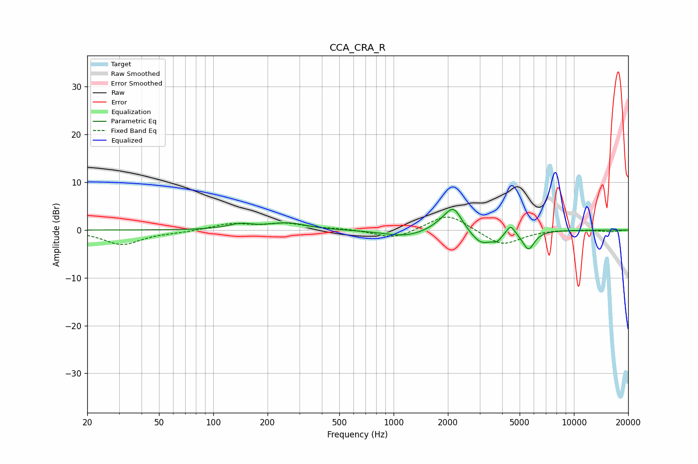

# CCA_CRA_R
See [usage instructions](https://github.com/jaakkopasanen/AutoEq#usage) for more options and info.

### Parametric EQs
Apply preamp of -4.4 dB when using parametric equalizer.

|   # | Type    |   Fc (Hz) |    Q |   Gain (dB) |
|-----|---------|-----------|------|-------------|
|   1 | Peaking |       141 | 2.07 |         1.1 |
|   2 | Peaking |       258 | 1.36 |         1.4 |
|   3 | Peaking |       431 | 0.91 |        -0   |
|   4 | Peaking |      1162 | 1.19 |        -1.4 |
|   5 | Peaking |      1915 | 2.08 |         1.5 |
|   6 | Peaking |      2157 | 3.11 |         4.3 |
|   7 | Peaking |      3067 | 2.33 |        -3.1 |
|   8 | Peaking |      3746 | 5.69 |        -1.2 |
|   9 | Peaking |      4460 | 6    |         2   |
|  10 | Peaking |      5596 | 4.23 |        -3.9 |

### Fixed Band EQs
When using fixed band (also called graphic) equalizer, apply preamp of **-2.8 dB** (if available) and set gains manually with these parameters.

|   # | Type    |   Fc (Hz) |    Q |   Gain (dB) |
|-----|---------|-----------|------|-------------|
|   1 | Peaking |        31 | 1.41 |        -3   |
|   2 | Peaking |        62 | 1.41 |        -0.4 |
|   3 | Peaking |       125 | 1.41 |         1.3 |
|   4 | Peaking |       250 | 1.41 |         1.3 |
|   5 | Peaking |       500 | 1.41 |         0.3 |
|   6 | Peaking |      1000 | 1.41 |        -1.9 |
|   7 | Peaking |      2000 | 1.41 |         3.6 |
|   8 | Peaking |      4000 | 1.41 |        -3.3 |
|   9 | Peaking |      8000 | 1.41 |         0.2 |
|  10 | Peaking |     16000 | 1.41 |        -0.3 |

### Graphs

