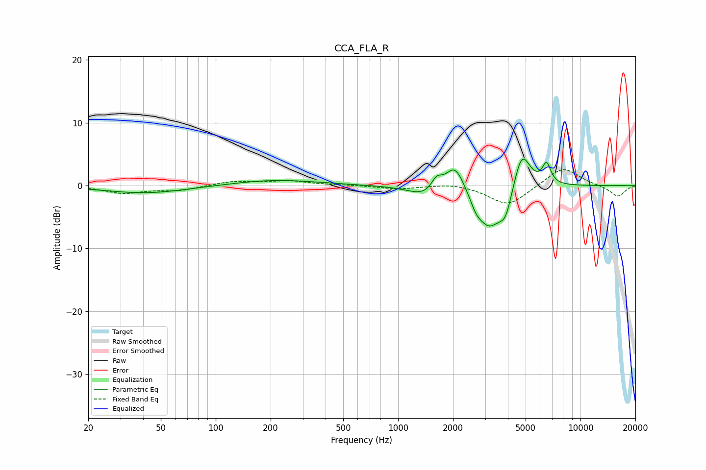

# CCA_FLA_R
See [usage instructions](https://github.com/jaakkopasanen/AutoEq#usage) for more options and info.

### Parametric EQs
Apply preamp of -4.3 dB when using parametric equalizer.

|   # | Type    |   Fc (Hz) |    Q |   Gain (dB) |
|-----|---------|-----------|------|-------------|
|   1 | Peaking |        41 | 0.63 |        -1.2 |
|   2 | Peaking |       212 | 0.61 |         0.9 |
|   3 | Peaking |      1389 | 1.64 |        -1.6 |
|   4 | Peaking |      1626 | 5.03 |         1.8 |
|   5 | Peaking |      2048 | 2.71 |         4.3 |
|   6 | Peaking |      2681 | 4.37 |        -1.7 |
|   7 | Peaking |      3156 | 2.11 |        -6.2 |
|   8 | Peaking |      3881 | 3.85 |        -3.9 |
|   9 | Peaking |      4768 | 3.05 |         6.3 |
|  10 | Peaking |      6519 | 5.97 |         3.2 |

### Fixed Band EQs
When using fixed band (also called graphic) equalizer, apply preamp of **-2.6 dB** (if available) and set gains manually with these parameters.

|   # | Type    |   Fc (Hz) |    Q |   Gain (dB) |
|-----|---------|-----------|------|-------------|
|   1 | Peaking |        31 | 1.41 |        -1.2 |
|   2 | Peaking |        62 | 1.41 |        -0.7 |
|   3 | Peaking |       125 | 1.41 |         0.7 |
|   4 | Peaking |       250 | 1.41 |         0.7 |
|   5 | Peaking |       500 | 1.41 |         0.1 |
|   6 | Peaking |      1000 | 1.41 |        -0.5 |
|   7 | Peaking |      2000 | 1.41 |         0.5 |
|   8 | Peaking |      4000 | 1.41 |        -3.2 |
|   9 | Peaking |      8000 | 1.41 |         3.1 |
|  10 | Peaking |     16000 | 1.41 |        -1.8 |

### Graphs

