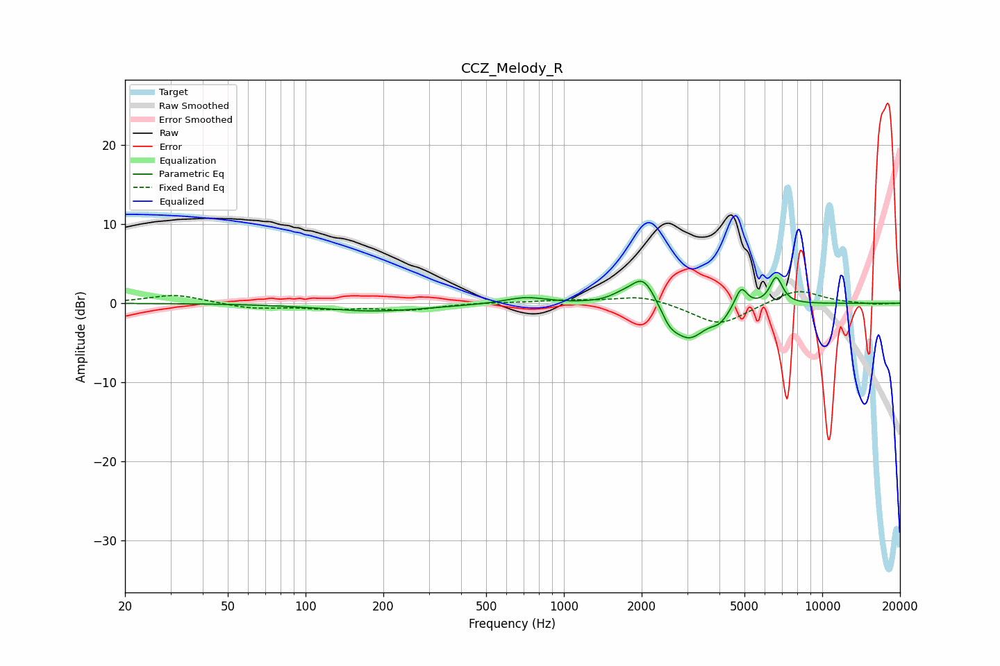

# CCZ_Melody_R
See [usage instructions](https://github.com/jaakkopasanen/AutoEq#usage) for more options and info.

### Parametric EQs
Apply preamp of -3.4 dB when using parametric equalizer.

|   # | Type    |   Fc (Hz) |    Q |   Gain (dB) |
|-----|---------|-----------|------|-------------|
|   1 | Peaking |       171 | 2.61 |        -0   |
|   2 | Peaking |       188 | 0.68 |        -1   |
|   3 | Peaking |       711 | 1.78 |         0.8 |
|   4 | Peaking |      1660 | 3.28 |         0.5 |
|   5 | Peaking |      2031 | 2.79 |         3.9 |
|   6 | Peaking |      2565 | 4.19 |        -1.5 |
|   7 | Peaking |      3051 | 2.06 |        -4.4 |
|   8 | Peaking |      4014 | 4.13 |        -1.3 |
|   9 | Peaking |      4854 | 5.91 |         2.6 |
|  10 | Peaking |      6634 | 5.5  |         3.4 |

### Fixed Band EQs
When using fixed band (also called graphic) equalizer, apply preamp of **-1.6 dB** (if available) and set gains manually with these parameters.

|   # | Type    |   Fc (Hz) |    Q |   Gain (dB) |
|-----|---------|-----------|------|-------------|
|   1 | Peaking |        31 | 1.41 |         1.1 |
|   2 | Peaking |        62 | 1.41 |        -0.7 |
|   3 | Peaking |       125 | 1.41 |        -0.6 |
|   4 | Peaking |       250 | 1.41 |        -0.8 |
|   5 | Peaking |       500 | 1.41 |         0.1 |
|   6 | Peaking |      1000 | 1.41 |         0.3 |
|   7 | Peaking |      2000 | 1.41 |         1   |
|   8 | Peaking |      4000 | 1.41 |        -2.8 |
|   9 | Peaking |      8000 | 1.41 |         1.8 |
|  10 | Peaking |     16000 | 1.41 |        -0.2 |

### Graphs

