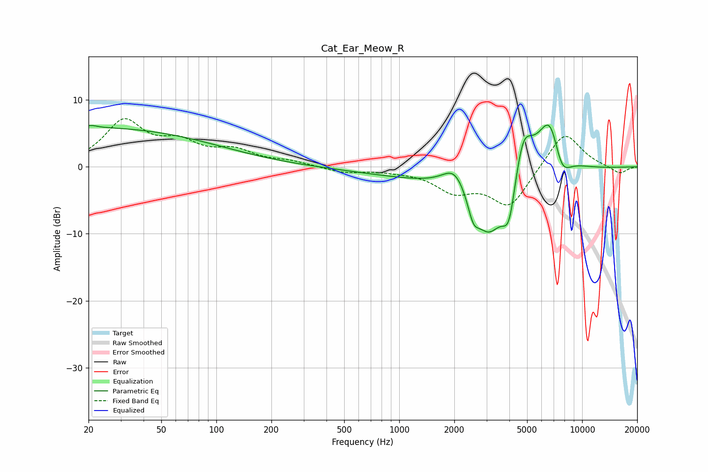

# Cat_Ear_Meow_R
See [usage instructions](https://github.com/jaakkopasanen/AutoEq#usage) for more options and info.

### Parametric EQs
Apply preamp of -6.3 dB when using parametric equalizer.

|   # | Type    |   Fc (Hz) |    Q |   Gain (dB) |
|-----|---------|-----------|------|-------------|
|   1 | Peaking |        20 | 0.18 |         5.8 |
|   2 | Peaking |        21 | 4.7  |         0.3 |
|   3 | Peaking |      2021 | 2.1  |         3.6 |
|   4 | Peaking |      2540 | 4.81 |        -2.9 |
|   5 | Peaking |      2547 | 0.25 |        -2   |
|   6 | Peaking |      3078 | 1.6  |        -8.4 |
|   7 | Peaking |      3988 | 3.66 |        -6.8 |
|   8 | Peaking |      4736 | 2.64 |         7.3 |
|   9 | Peaking |      6725 | 1.83 |        10.5 |
|  10 | Peaking |      7655 | 2.48 |        -5.5 |

### Fixed Band EQs
When using fixed band (also called graphic) equalizer, apply preamp of **-7.3 dB** (if available) and set gains manually with these parameters.

|   # | Type    |   Fc (Hz) |    Q |   Gain (dB) |
|-----|---------|-----------|------|-------------|
|   1 | Peaking |        31 | 1.41 |         6.5 |
|   2 | Peaking |        62 | 1.41 |         3   |
|   3 | Peaking |       125 | 1.41 |         2.1 |
|   4 | Peaking |       250 | 1.41 |         0.7 |
|   5 | Peaking |       500 | 1.41 |        -0.8 |
|   6 | Peaking |      1000 | 1.41 |        -0.4 |
|   7 | Peaking |      2000 | 1.41 |        -3.3 |
|   8 | Peaking |      4000 | 1.41 |        -5.9 |
|   9 | Peaking |      8000 | 1.41 |         5.5 |
|  10 | Peaking |     16000 | 1.41 |        -1.1 |

### Graphs

