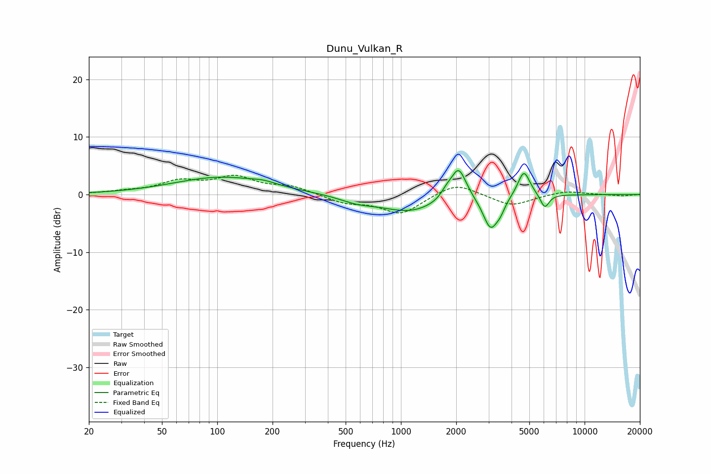

# Dunu_Vulkan_R
See [usage instructions](https://github.com/jaakkopasanen/AutoEq#usage) for more options and info.

### Parametric EQs
Apply preamp of -4.3 dB when using parametric equalizer.

|   # | Type    |   Fc (Hz) |    Q |   Gain (dB) |
|-----|---------|-----------|------|-------------|
|   1 | Peaking |       105 | 0.55 |         3   |
|   2 | Peaking |       179 | 2.28 |         0.5 |
|   3 | Peaking |       575 | 1.51 |        -0.9 |
|   4 | Peaking |      1123 | 0.87 |        -2.9 |
|   5 | Peaking |      1770 | 4.69 |         1.1 |
|   6 | Peaking |      2060 | 3.32 |         5.7 |
|   7 | Peaking |      3080 | 3.39 |        -5.8 |
|   8 | Peaking |      3482 | 6    |        -1.2 |
|   9 | Peaking |      4670 | 4.16 |         4.6 |
|  10 | Peaking |      6067 | 5.77 |        -2.5 |

### Fixed Band EQs
When using fixed band (also called graphic) equalizer, apply preamp of **-3.5 dB** (if available) and set gains manually with these parameters.

|   # | Type    |   Fc (Hz) |    Q |   Gain (dB) |
|-----|---------|-----------|------|-------------|
|   1 | Peaking |        31 | 1.41 |         0.4 |
|   2 | Peaking |        62 | 1.41 |         2.1 |
|   3 | Peaking |       125 | 1.41 |         2.8 |
|   4 | Peaking |       250 | 1.41 |         1.3 |
|   5 | Peaking |       500 | 1.41 |        -1.4 |
|   6 | Peaking |      1000 | 1.41 |        -3.3 |
|   7 | Peaking |      2000 | 1.41 |         2.2 |
|   8 | Peaking |      4000 | 1.41 |        -2   |
|   9 | Peaking |      8000 | 1.41 |         0.7 |
|  10 | Peaking |     16000 | 1.41 |        -0.2 |

### Graphs

