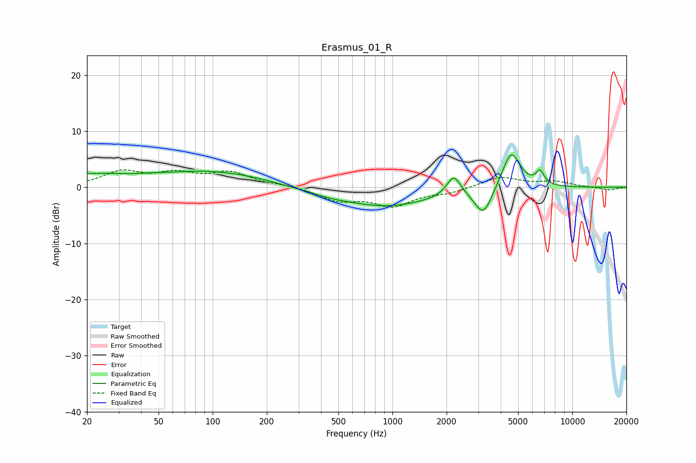

# Erasmus_01_R
See [usage instructions](https://github.com/jaakkopasanen/AutoEq#usage) for more options and info.

### Parametric EQs
Apply preamp of -5.9 dB when using parametric equalizer.

|   # | Type    |   Fc (Hz) |    Q |   Gain (dB) |
|-----|---------|-----------|------|-------------|
|   1 | Peaking |        27 | 0.19 |         2.5 |
|   2 | Peaking |        35 | 2.34 |        -0.2 |
|   3 | Peaking |        85 | 1.48 |         0.3 |
|   4 | Peaking |       138 | 0.71 |         1.2 |
|   5 | Peaking |       436 | 1.33 |        -0.5 |
|   6 | Peaking |       920 | 0.55 |        -3.4 |
|   7 | Peaking |      2192 | 3.73 |         3.6 |
|   8 | Peaking |      3207 | 2.89 |        -5   |
|   9 | Peaking |      4566 | 2.75 |         6.8 |
|  10 | Peaking |      6618 | 6    |         2.3 |

### Fixed Band EQs
When using fixed band (also called graphic) equalizer, apply preamp of **-3.2 dB** (if available) and set gains manually with these parameters.

|   # | Type    |   Fc (Hz) |    Q |   Gain (dB) |
|-----|---------|-----------|------|-------------|
|   1 | Peaking |        31 | 1.41 |         2.6 |
|   2 | Peaking |        62 | 1.41 |         2.1 |
|   3 | Peaking |       125 | 1.41 |         2.4 |
|   4 | Peaking |       250 | 1.41 |         0.4 |
|   5 | Peaking |       500 | 1.41 |        -2.2 |
|   6 | Peaking |      1000 | 1.41 |        -3.1 |
|   7 | Peaking |      2000 | 1.41 |        -0.9 |
|   8 | Peaking |      4000 | 1.41 |         1.9 |
|   9 | Peaking |      8000 | 1.41 |         0.9 |
|  10 | Peaking |     16000 | 1.41 |        -0.5 |

### Graphs

