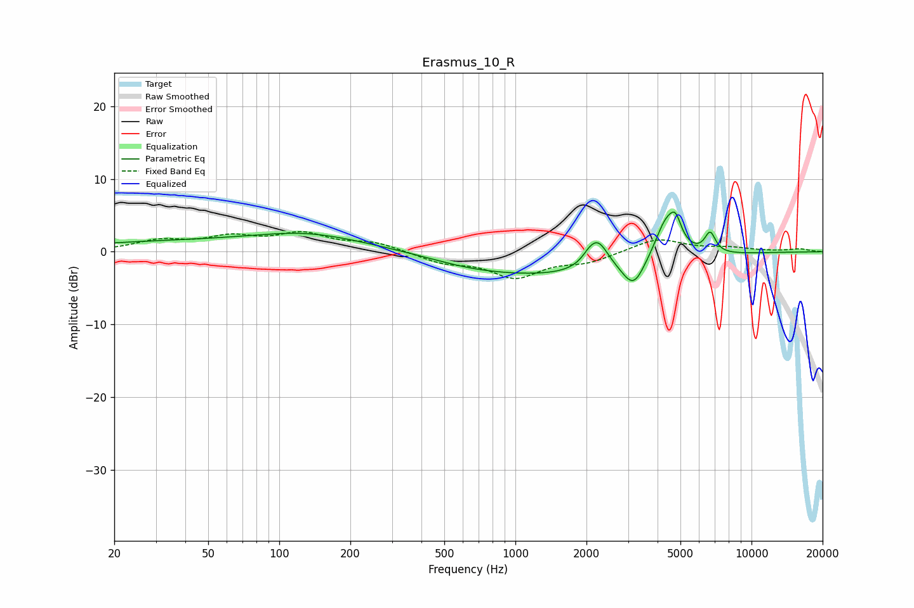

# Erasmus_10_R
See [usage instructions](https://github.com/jaakkopasanen/AutoEq#usage) for more options and info.

### Parametric EQs
Apply preamp of -5.5 dB when using parametric equalizer.

|   # | Type    |   Fc (Hz) |    Q |   Gain (dB) |
|-----|---------|-----------|------|-------------|
|   1 | Peaking |        67 | 0.18 |         1.5 |
|   2 | Peaking |       129 | 0.69 |         1.3 |
|   3 | Peaking |       638 | 0.89 |        -0.4 |
|   4 | Peaking |      1437 | 0.35 |        -3.2 |
|   5 | Peaking |      2037 | 5.97 |         0.4 |
|   6 | Peaking |      2227 | 3.05 |         4.2 |
|   7 | Peaking |      3169 | 2.98 |        -3.7 |
|   8 | Peaking |      4366 | 2.74 |         5.7 |
|   9 | Peaking |      4775 | 5.98 |         2.5 |
|  10 | Peaking |      6678 | 6    |         2.8 |

### Fixed Band EQs
When using fixed band (also called graphic) equalizer, apply preamp of **-2.9 dB** (if available) and set gains manually with these parameters.

|   # | Type    |   Fc (Hz) |    Q |   Gain (dB) |
|-----|---------|-----------|------|-------------|
|   1 | Peaking |        31 | 1.41 |         1.4 |
|   2 | Peaking |        62 | 1.41 |         1.8 |
|   3 | Peaking |       125 | 1.41 |         2.3 |
|   4 | Peaking |       250 | 1.41 |         1.2 |
|   5 | Peaking |       500 | 1.41 |        -1.4 |
|   6 | Peaking |      1000 | 1.41 |        -3.3 |
|   7 | Peaking |      2000 | 1.41 |        -1.3 |
|   8 | Peaking |      4000 | 1.41 |         1.9 |
|   9 | Peaking |      8000 | 1.41 |         0.5 |
|  10 | Peaking |     16000 | 1.41 |         0.4 |

### Graphs

