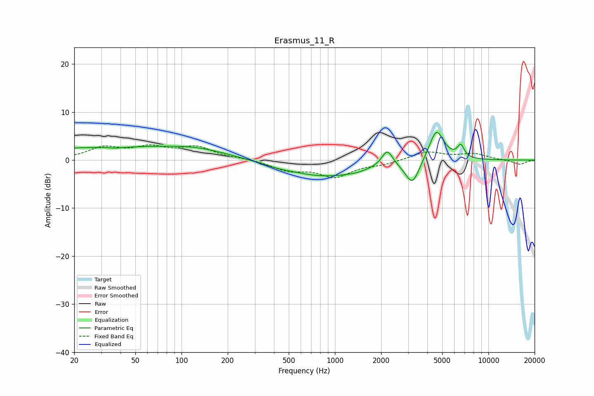

# Erasmus_11_R
See [usage instructions](https://github.com/jaakkopasanen/AutoEq#usage) for more options and info.

### Parametric EQs
Apply preamp of -5.9 dB when using parametric equalizer.

|   # | Type    |   Fc (Hz) |    Q |   Gain (dB) |
|-----|---------|-----------|------|-------------|
|   1 | Peaking |        31 | 0.24 |         2.6 |
|   2 | Peaking |        38 | 2.39 |        -0.3 |
|   3 | Peaking |       128 | 0.68 |         1.4 |
|   4 | Peaking |       414 | 1.6  |        -0.4 |
|   5 | Peaking |       840 | 0.59 |        -3.3 |
|   6 | Peaking |      1374 | 1.72 |        -0.4 |
|   7 | Peaking |      2192 | 4    |         3.4 |
|   8 | Peaking |      3197 | 3.07 |        -5.1 |
|   9 | Peaking |      4583 | 2.86 |         6.7 |
|  10 | Peaking |      6613 | 6    |         2.5 |

### Fixed Band EQs
When using fixed band (also called graphic) equalizer, apply preamp of **-3.3 dB** (if available) and set gains manually with these parameters.

|   # | Type    |   Fc (Hz) |    Q |   Gain (dB) |
|-----|---------|-----------|------|-------------|
|   1 | Peaking |        31 | 1.41 |         2.4 |
|   2 | Peaking |        62 | 1.41 |         2.3 |
|   3 | Peaking |       125 | 1.41 |         2.5 |
|   4 | Peaking |       250 | 1.41 |         0.3 |
|   5 | Peaking |       500 | 1.41 |        -2   |
|   6 | Peaking |      1000 | 1.41 |        -3.3 |
|   7 | Peaking |      2000 | 1.41 |        -0.8 |
|   8 | Peaking |      4000 | 1.41 |         1.7 |
|   9 | Peaking |      8000 | 1.41 |         1.2 |
|  10 | Peaking |     16000 | 1.41 |        -0.9 |

### Graphs

