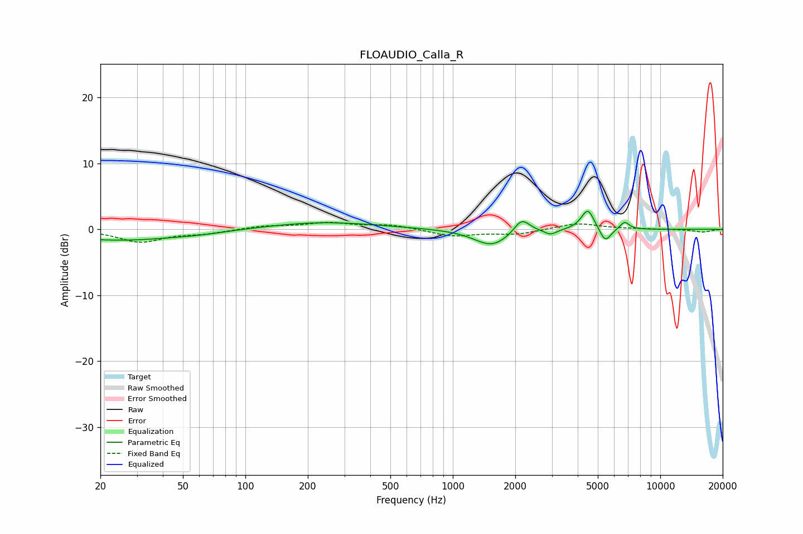

# FLOAUDIO_Calla_R
See [usage instructions](https://github.com/jaakkopasanen/AutoEq#usage) for more options and info.

### Parametric EQs
Apply preamp of -2.8 dB when using parametric equalizer.

|   # | Type    |   Fc (Hz) |    Q |   Gain (dB) |
|-----|---------|-----------|------|-------------|
|   1 | Peaking |        20 | 5.72 |        -0   |
|   2 | Peaking |        25 | 0.51 |        -1.6 |
|   3 | Peaking |        61 | 1.11 |        -0.3 |
|   4 | Peaking |       237 | 0.54 |         1.1 |
|   5 | Peaking |      1541 | 1.67 |        -2.6 |
|   6 | Peaking |      2150 | 3.78 |         2.2 |
|   7 | Peaking |      2957 | 4.82 |        -0.8 |
|   8 | Peaking |      4473 | 4.51 |         3.2 |
|   9 | Peaking |      5433 | 5.2  |        -2.2 |
|  10 | Peaking |      6733 | 6    |         1.2 |

### Fixed Band EQs
When using fixed band (also called graphic) equalizer, apply preamp of **-1.2 dB** (if available) and set gains manually with these parameters.

|   # | Type    |   Fc (Hz) |    Q |   Gain (dB) |
|-----|---------|-----------|------|-------------|
|   1 | Peaking |        31 | 1.41 |        -1.9 |
|   2 | Peaking |        62 | 1.41 |        -0.6 |
|   3 | Peaking |       125 | 1.41 |         0.5 |
|   4 | Peaking |       250 | 1.41 |         0.9 |
|   5 | Peaking |       500 | 1.41 |         0.7 |
|   6 | Peaking |      1000 | 1.41 |        -1   |
|   7 | Peaking |      2000 | 1.41 |        -0.7 |
|   8 | Peaking |      4000 | 1.41 |         1   |
|   9 | Peaking |      8000 | 1.41 |         0   |
|  10 | Peaking |     16000 | 1.41 |        -0.4 |

### Graphs

