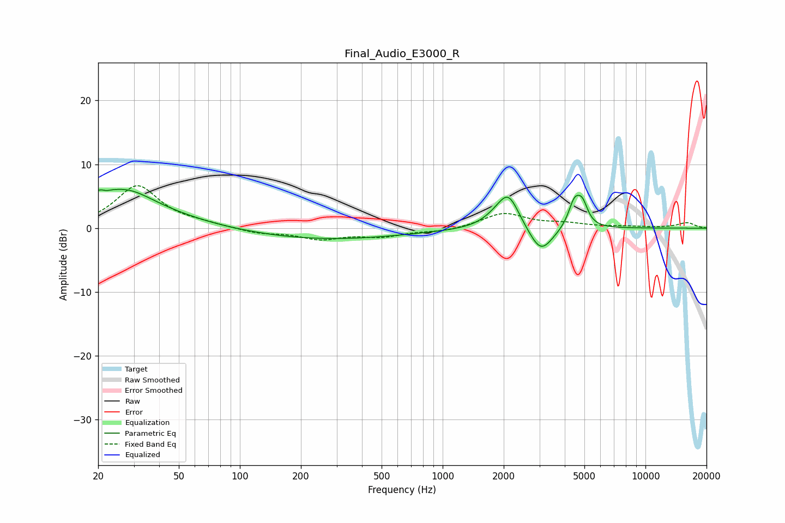

# Final_Audio_E3000_R
See [usage instructions](https://github.com/jaakkopasanen/AutoEq#usage) for more options and info.

### Parametric EQs
Apply preamp of -6.2 dB when using parametric equalizer.

|   # | Type    |   Fc (Hz) |    Q |   Gain (dB) |
|-----|---------|-----------|------|-------------|
|   1 | Peaking |        21 | 5.64 |         2.7 |
|   2 | Peaking |        21 | 5.92 |        -2.6 |
|   3 | Peaking |        22 | 0.52 |         5.2 |
|   4 | Peaking |        29 | 1.41 |         1.3 |
|   5 | Peaking |       261 | 0.36 |        -1.8 |
|   6 | Peaking |      1819 | 2.17 |         0.9 |
|   7 | Peaking |      2109 | 2.6  |         5.2 |
|   8 | Peaking |      3050 | 2.4  |        -4.3 |
|   9 | Peaking |      4465 | 4.7  |         4   |
|  10 | Peaking |      4890 | 5.31 |         3   |

### Fixed Band EQs
When using fixed band (also called graphic) equalizer, apply preamp of **-6.7 dB** (if available) and set gains manually with these parameters.

|   # | Type    |   Fc (Hz) |    Q |   Gain (dB) |
|-----|---------|-----------|------|-------------|
|   1 | Peaking |        31 | 1.41 |         6.6 |
|   2 | Peaking |        62 | 1.41 |         0.5 |
|   3 | Peaking |       125 | 1.41 |        -0.8 |
|   4 | Peaking |       250 | 1.41 |        -1.6 |
|   5 | Peaking |       500 | 1.41 |        -1.2 |
|   6 | Peaking |      1000 | 1.41 |        -0.5 |
|   7 | Peaking |      2000 | 1.41 |         2.3 |
|   8 | Peaking |      4000 | 1.41 |         0.6 |
|   9 | Peaking |      8000 | 1.41 |         0.2 |
|  10 | Peaking |     16000 | 1.41 |         0.8 |

### Graphs

