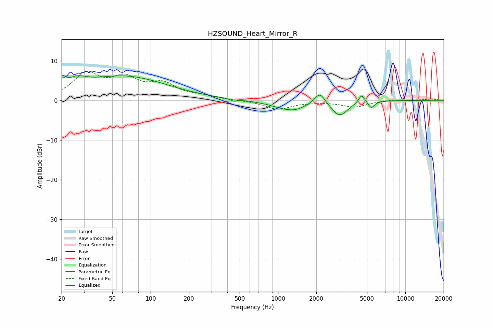

# HZSOUND_Heart_Mirror_R
See [usage instructions](https://github.com/jaakkopasanen/AutoEq#usage) for more options and info.

### Parametric EQs
Apply preamp of -6.4 dB when using parametric equalizer.

|   # | Type    |   Fc (Hz) |    Q |   Gain (dB) |
|-----|---------|-----------|------|-------------|
|   1 | Peaking |        20 | 5.56 |         2.5 |
|   2 | Peaking |        26 | 1.84 |         2.3 |
|   3 | Peaking |        62 | 0.41 |         6   |
|   4 | Peaking |       449 | 5.92 |        -0.5 |
|   5 | Peaking |      1224 | 1.09 |        -2.3 |
|   6 | Peaking |      1393 | 2.88 |        -0.3 |
|   7 | Peaking |      2131 | 3.4  |         3.1 |
|   8 | Peaking |      3050 | 2.25 |        -3.7 |
|   9 | Peaking |      4535 | 6    |         2.2 |
|  10 | Peaking |      5400 | 5.88 |        -1.7 |

### Fixed Band EQs
When using fixed band (also called graphic) equalizer, apply preamp of **-7.4 dB** (if available) and set gains manually with these parameters.

|   # | Type    |   Fc (Hz) |    Q |   Gain (dB) |
|-----|---------|-----------|------|-------------|
|   1 | Peaking |        31 | 1.41 |         6.2 |
|   2 | Peaking |        62 | 1.41 |         4.7 |
|   3 | Peaking |       125 | 1.41 |         3.7 |
|   4 | Peaking |       250 | 1.41 |         0.8 |
|   5 | Peaking |       500 | 1.41 |        -0   |
|   6 | Peaking |      1000 | 1.41 |        -2.2 |
|   7 | Peaking |      2000 | 1.41 |        -0.2 |
|   8 | Peaking |      4000 | 1.41 |        -1.6 |
|   9 | Peaking |      8000 | 1.41 |         0.3 |
|  10 | Peaking |     16000 | 1.41 |         0.3 |

### Graphs

