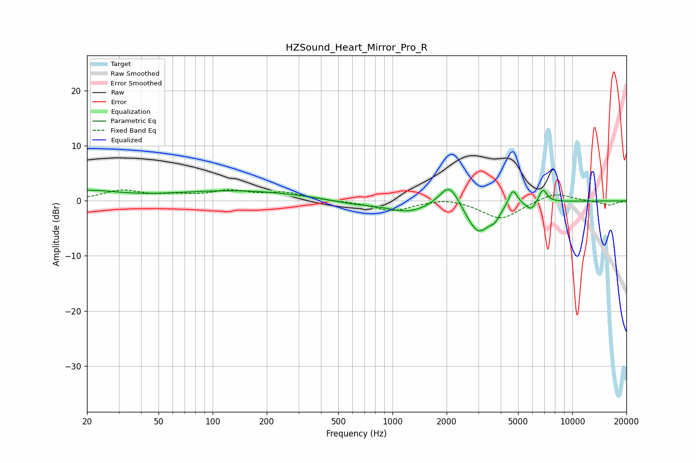

# HZSound_Heart_Mirror_Pro_R
See [usage instructions](https://github.com/jaakkopasanen/AutoEq#usage) for more options and info.

### Parametric EQs
Apply preamp of -2.2 dB when using parametric equalizer.

|   # | Type    |   Fc (Hz) |    Q |   Gain (dB) |
|-----|---------|-----------|------|-------------|
|   1 | Peaking |        20 | 0.83 |         1.7 |
|   2 | Peaking |       136 | 0.39 |         1.8 |
|   3 | Peaking |       611 | 1.1  |        -0.6 |
|   4 | Peaking |      1227 | 1.22 |        -1.9 |
|   5 | Peaking |      2076 | 2.56 |         4.4 |
|   6 | Peaking |      3003 | 2.06 |        -6   |
|   7 | Peaking |      3715 | 5.83 |        -1.3 |
|   8 | Peaking |      4676 | 5.88 |         3.1 |
|   9 | Peaking |      5893 | 5.33 |        -1.5 |
|  10 | Peaking |      6862 | 6    |         2.5 |

### Fixed Band EQs
When using fixed band (also called graphic) equalizer, apply preamp of **-2.1 dB** (if available) and set gains manually with these parameters.

|   # | Type    |   Fc (Hz) |    Q |   Gain (dB) |
|-----|---------|-----------|------|-------------|
|   1 | Peaking |        31 | 1.41 |         1.8 |
|   2 | Peaking |        62 | 1.41 |         0.8 |
|   3 | Peaking |       125 | 1.41 |         1.6 |
|   4 | Peaking |       250 | 1.41 |         1.3 |
|   5 | Peaking |       500 | 1.41 |        -0.1 |
|   6 | Peaking |      1000 | 1.41 |        -1.8 |
|   7 | Peaking |      2000 | 1.41 |         0.7 |
|   8 | Peaking |      4000 | 1.41 |        -3.4 |
|   9 | Peaking |      8000 | 1.41 |         1.6 |
|  10 | Peaking |     16000 | 1.41 |        -0.8 |

### Graphs

