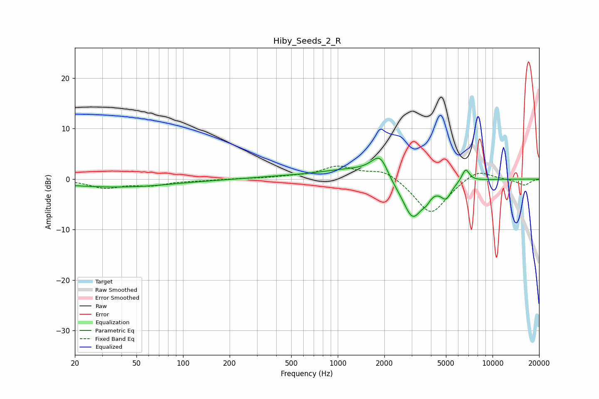

# Hiby_Seeds_2_R
See [usage instructions](https://github.com/jaakkopasanen/AutoEq#usage) for more options and info.

### Parametric EQs
Apply preamp of -4.2 dB when using parametric equalizer.

|   # | Type    |   Fc (Hz) |    Q |   Gain (dB) |
|-----|---------|-----------|------|-------------|
|   1 | Peaking |        23 | 0.38 |        -0.9 |
|   2 | Peaking |        52 | 0.48 |        -0.9 |
|   3 | Peaking |       399 | 0.88 |         0.3 |
|   4 | Peaking |      1227 | 0.65 |         1.9 |
|   5 | Peaking |      1895 | 2.4  |         5.4 |
|   6 | Peaking |      2131 | 2    |        -1.7 |
|   7 | Peaking |      3049 | 2.1  |        -8   |
|   8 | Peaking |      3735 | 5.38 |        -1.2 |
|   9 | Peaking |      5006 | 3.88 |        -3   |
|  10 | Peaking |      6703 | 5.56 |         2.5 |

### Fixed Band EQs
When using fixed band (also called graphic) equalizer, apply preamp of **-2.7 dB** (if available) and set gains manually with these parameters.

|   # | Type    |   Fc (Hz) |    Q |   Gain (dB) |
|-----|---------|-----------|------|-------------|
|   1 | Peaking |        31 | 1.41 |        -1.6 |
|   2 | Peaking |        62 | 1.41 |        -1.1 |
|   3 | Peaking |       125 | 1.41 |        -0.2 |
|   4 | Peaking |       250 | 1.41 |         0.1 |
|   5 | Peaking |       500 | 1.41 |         0.3 |
|   6 | Peaking |      1000 | 1.41 |         2.4 |
|   7 | Peaking |      2000 | 1.41 |         2   |
|   8 | Peaking |      4000 | 1.41 |        -7.1 |
|   9 | Peaking |      8000 | 1.41 |         2.2 |
|  10 | Peaking |     16000 | 1.41 |        -1.2 |

### Graphs

