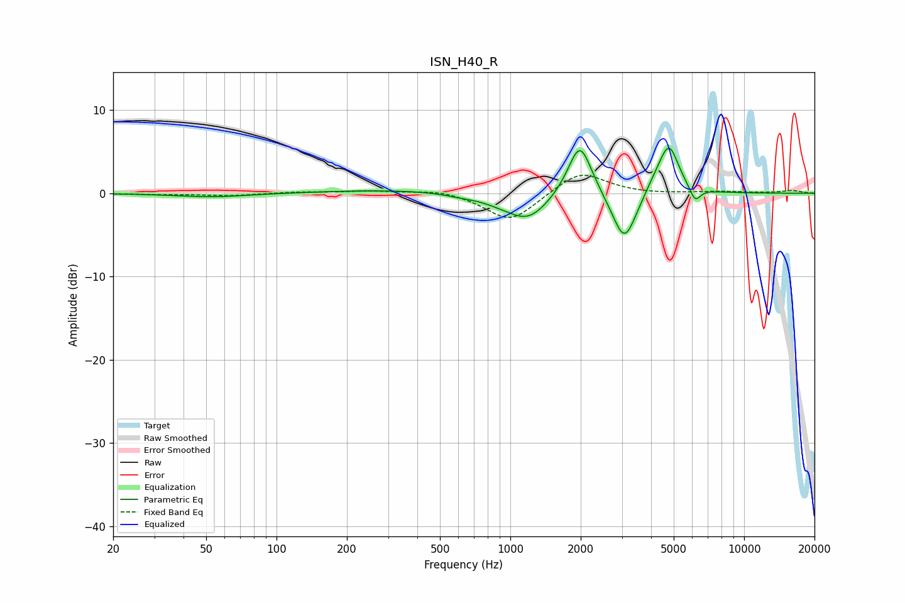

# ISN_H40_R
See [usage instructions](https://github.com/jaakkopasanen/AutoEq#usage) for more options and info.

### Parametric EQs
Apply preamp of -5.5 dB when using parametric equalizer.

|   # | Type    |   Fc (Hz) |    Q |   Gain (dB) |
|-----|---------|-----------|------|-------------|
|   1 | Peaking |        53 | 0.9  |        -0.5 |
|   2 | Peaking |       334 | 0.46 |         0.4 |
|   3 | Peaking |       609 | 2.24 |        -0.2 |
|   4 | Peaking |       938 | 1.36 |        -0.7 |
|   5 | Peaking |      1200 | 1.59 |        -2.9 |
|   6 | Peaking |      1984 | 2.73 |         6.7 |
|   7 | Peaking |      3079 | 2.67 |        -6.4 |
|   8 | Peaking |      4245 | 2.41 |         1.6 |
|   9 | Peaking |      4781 | 3.39 |         5.2 |
|  10 | Peaking |      6170 | 6    |        -1.8 |

### Fixed Band EQs
When using fixed band (also called graphic) equalizer, apply preamp of **-2.3 dB** (if available) and set gains manually with these parameters.

|   # | Type    |   Fc (Hz) |    Q |   Gain (dB) |
|-----|---------|-----------|------|-------------|
|   1 | Peaking |        31 | 1.41 |        -0.1 |
|   2 | Peaking |        62 | 1.41 |        -0.3 |
|   3 | Peaking |       125 | 1.41 |         0.2 |
|   4 | Peaking |       250 | 1.41 |         0.3 |
|   5 | Peaking |       500 | 1.41 |         0.5 |
|   6 | Peaking |      1000 | 1.41 |        -3.5 |
|   7 | Peaking |      2000 | 1.41 |         2.8 |
|   8 | Peaking |      4000 | 1.41 |        -0.1 |
|   9 | Peaking |      8000 | 1.41 |         0.2 |
|  10 | Peaking |     16000 | 1.41 |         0.3 |

### Graphs

