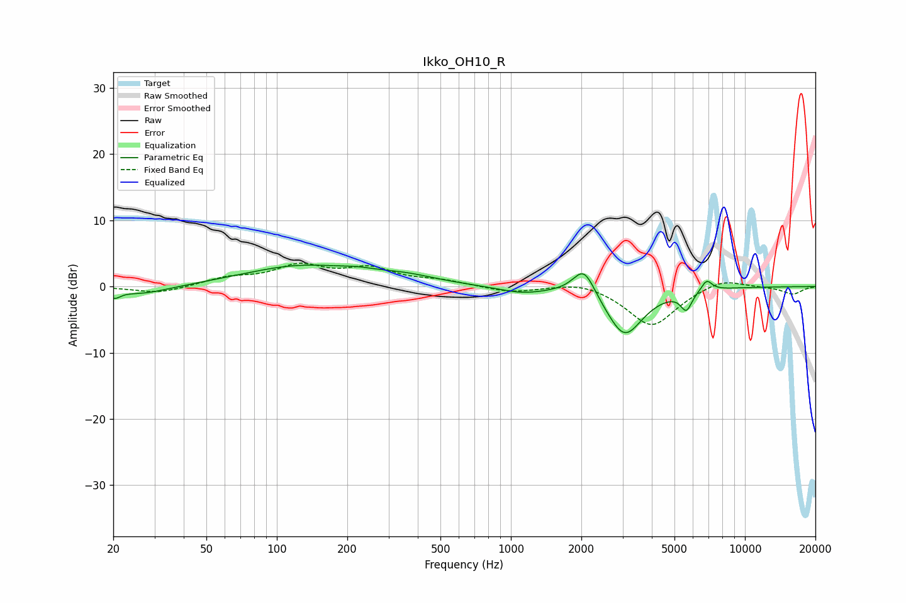

# Ikko_OH10_R
See [usage instructions](https://github.com/jaakkopasanen/AutoEq#usage) for more options and info.

### Parametric EQs
Apply preamp of -3.3 dB when using parametric equalizer.

|   # | Type    |   Fc (Hz) |    Q |   Gain (dB) |
|-----|---------|-----------|------|-------------|
|   1 | Peaking |        20 | 5.94 |        -1.1 |
|   2 | Peaking |        27 | 1.17 |        -1.3 |
|   3 | Peaking |       126 | 0.59 |         3   |
|   4 | Peaking |       220 | 1.85 |         0.5 |
|   5 | Peaking |       354 | 1.03 |         1.1 |
|   6 | Peaking |      1112 | 1.42 |        -0.9 |
|   7 | Peaking |      2053 | 2.99 |         4.4 |
|   8 | Peaking |      3059 | 1.78 |        -7.5 |
|   9 | Peaking |      5619 | 5.78 |        -2.7 |
|  10 | Peaking |      6863 | 5.93 |         1.7 |

### Fixed Band EQs
When using fixed band (also called graphic) equalizer, apply preamp of **-3.6 dB** (if available) and set gains manually with these parameters.

|   # | Type    |   Fc (Hz) |    Q |   Gain (dB) |
|-----|---------|-----------|------|-------------|
|   1 | Peaking |        31 | 1.41 |        -1.1 |
|   2 | Peaking |        62 | 1.41 |         1.2 |
|   3 | Peaking |       125 | 1.41 |         2.9 |
|   4 | Peaking |       250 | 1.41 |         2.4 |
|   5 | Peaking |       500 | 1.41 |         0.8 |
|   6 | Peaking |      1000 | 1.41 |        -0.9 |
|   7 | Peaking |      2000 | 1.41 |         0.9 |
|   8 | Peaking |      4000 | 1.41 |        -6.1 |
|   9 | Peaking |      8000 | 1.41 |         1.4 |
|  10 | Peaking |     16000 | 1.41 |        -1.1 |

### Graphs

