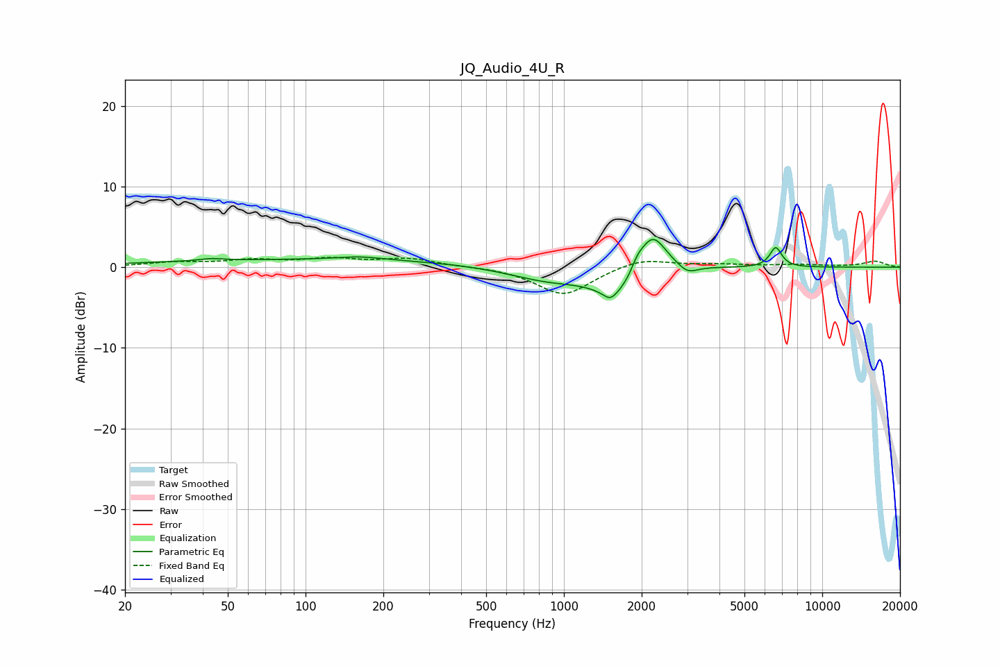

# JQ_Audio_4U_R
See [usage instructions](https://github.com/jaakkopasanen/AutoEq#usage) for more options and info.

### Parametric EQs
Apply preamp of -3.5 dB when using parametric equalizer.

|   # | Type    |   Fc (Hz) |    Q |   Gain (dB) |
|-----|---------|-----------|------|-------------|
|   1 | Peaking |        43 | 3.37 |         0.3 |
|   2 | Peaking |       114 | 0.18 |         0.9 |
|   3 | Peaking |       163 | 1.57 |         0.4 |
|   4 | Peaking |       882 | 0.86 |        -1.8 |
|   5 | Peaking |      1510 | 6    |        -0.9 |
|   6 | Peaking |      1620 | 1.64 |        -3.5 |
|   7 | Peaking |      1924 | 5.99 |         1.1 |
|   8 | Peaking |      2195 | 2.58 |         5.3 |
|   9 | Peaking |      3012 | 3.8  |        -1.1 |
|  10 | Peaking |      6609 | 6    |         2.5 |

### Fixed Band EQs
When using fixed band (also called graphic) equalizer, apply preamp of **-1.3 dB** (if available) and set gains manually with these parameters.

|   # | Type    |   Fc (Hz) |    Q |   Gain (dB) |
|-----|---------|-----------|------|-------------|
|   1 | Peaking |        31 | 1.41 |         0.5 |
|   2 | Peaking |        62 | 1.41 |         0.8 |
|   3 | Peaking |       125 | 1.41 |         0.9 |
|   4 | Peaking |       250 | 1.41 |         1   |
|   5 | Peaking |       500 | 1.41 |         0.1 |
|   6 | Peaking |      1000 | 1.41 |        -3.5 |
|   7 | Peaking |      2000 | 1.41 |         1.2 |
|   8 | Peaking |      4000 | 1.41 |         0.3 |
|   9 | Peaking |      8000 | 1.41 |         0.3 |
|  10 | Peaking |     16000 | 1.41 |         0.7 |

### Graphs

