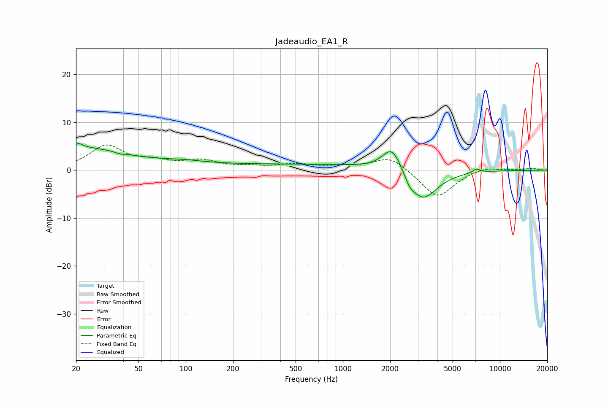

# Jadeaudio_EA1_R
See [usage instructions](https://github.com/jaakkopasanen/AutoEq#usage) for more options and info.

### Parametric EQs
Apply preamp of -5.6 dB when using parametric equalizer.

|   # | Type    |   Fc (Hz) |    Q |   Gain (dB) |
|-----|---------|-----------|------|-------------|
|   1 | Peaking |        20 | 0.45 |         4.7 |
|   2 | Peaking |        21 | 6    |         0.8 |
|   3 | Peaking |        38 | 5.98 |        -0.3 |
|   4 | Peaking |        95 | 0.98 |         0.7 |
|   5 | Peaking |       539 | 0.18 |         1.2 |
|   6 | Peaking |      2058 | 2.3  |         5.4 |
|   7 | Peaking |      2669 | 4.8  |        -1.4 |
|   8 | Peaking |      3201 | 0.95 |        -1.6 |
|   9 | Peaking |      3224 | 1.7  |        -5.2 |
|  10 | Peaking |      7082 | 6    |         0.8 |

### Fixed Band EQs
When using fixed band (also called graphic) equalizer, apply preamp of **-5.4 dB** (if available) and set gains manually with these parameters.

|   # | Type    |   Fc (Hz) |    Q |   Gain (dB) |
|-----|---------|-----------|------|-------------|
|   1 | Peaking |        31 | 1.41 |         4.9 |
|   2 | Peaking |        62 | 1.41 |         1.4 |
|   3 | Peaking |       125 | 1.41 |         1.8 |
|   4 | Peaking |       250 | 1.41 |         0.5 |
|   5 | Peaking |       500 | 1.41 |         1.1 |
|   6 | Peaking |      1000 | 1.41 |         0.6 |
|   7 | Peaking |      2000 | 1.41 |         3   |
|   8 | Peaking |      4000 | 1.41 |        -5.9 |
|   9 | Peaking |      8000 | 1.41 |         0.9 |
|  10 | Peaking |     16000 | 1.41 |         0.4 |

### Graphs

