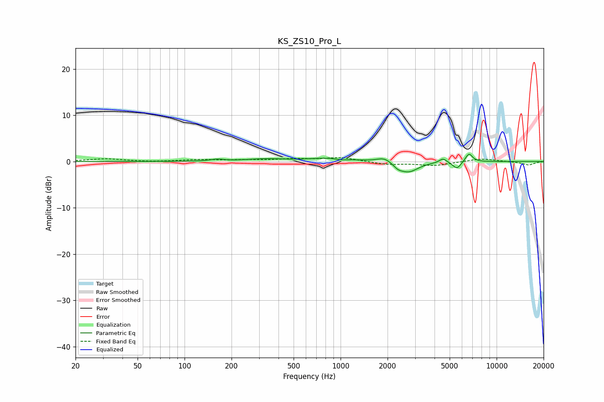

# KS_ZS10_Pro_L
See [usage instructions](https://github.com/jaakkopasanen/AutoEq#usage) for more options and info.

### Parametric EQs
Apply preamp of -1.6 dB when using parametric equalizer.

|   # | Type    |   Fc (Hz) |    Q |   Gain (dB) |
|-----|---------|-----------|------|-------------|
|   1 | Peaking |       162 | 3.55 |         0.4 |
|   2 | Peaking |       331 | 1.19 |         0.5 |
|   3 | Peaking |       883 | 1.12 |         0.8 |
|   4 | Peaking |      1004 | 3.06 |        -0.4 |
|   5 | Peaking |      1907 | 3.1  |         1.1 |
|   6 | Peaking |      2329 | 5    |        -0.7 |
|   7 | Peaking |      2718 | 2.26 |        -2.3 |
|   8 | Peaking |      4535 | 6    |         0.9 |
|   9 | Peaking |      5565 | 5.28 |        -1.6 |
|  10 | Peaking |      6649 | 6    |         1.9 |

### Fixed Band EQs
When using fixed band (also called graphic) equalizer, apply preamp of **-0.9 dB** (if available) and set gains manually with these parameters.

|   # | Type    |   Fc (Hz) |    Q |   Gain (dB) |
|-----|---------|-----------|------|-------------|
|   1 | Peaking |        31 | 1.41 |         0.6 |
|   2 | Peaking |        62 | 1.41 |        -0.1 |
|   3 | Peaking |       125 | 1.41 |         0.4 |
|   4 | Peaking |       250 | 1.41 |         0.3 |
|   5 | Peaking |       500 | 1.41 |         0.5 |
|   6 | Peaking |      1000 | 1.41 |         0.9 |
|   7 | Peaking |      2000 | 1.41 |        -0.6 |
|   8 | Peaking |      4000 | 1.41 |        -0.9 |
|   9 | Peaking |      8000 | 1.41 |         0.7 |
|  10 | Peaking |     16000 | 1.41 |        -0.8 |

### Graphs

