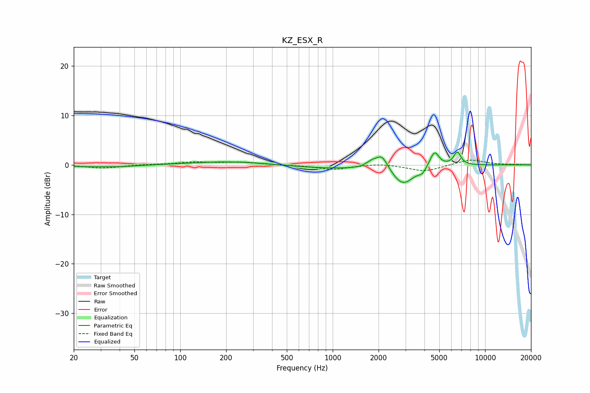

# KZ_ESX_R
See [usage instructions](https://github.com/jaakkopasanen/AutoEq#usage) for more options and info.

### Parametric EQs
Apply preamp of -2.6 dB when using parametric equalizer.

|   # | Type    |   Fc (Hz) |    Q |   Gain (dB) |
|-----|---------|-----------|------|-------------|
|   1 | Peaking |        23 | 2.19 |        -0.2 |
|   2 | Peaking |        38 | 1.04 |        -0.4 |
|   3 | Peaking |       221 | 0.55 |         0.7 |
|   4 | Peaking |       990 | 0.48 |        -0.7 |
|   5 | Peaking |      1797 | 3.97 |         1   |
|   6 | Peaking |      2103 | 3.58 |         2.9 |
|   7 | Peaking |      2887 | 1.98 |        -3.9 |
|   8 | Peaking |      3861 | 5.97 |        -1   |
|   9 | Peaking |      4653 | 4.69 |         3.2 |
|  10 | Peaking |      6566 | 5.73 |         2.6 |

### Fixed Band EQs
When using fixed band (also called graphic) equalizer, apply preamp of **-1.0 dB** (if available) and set gains manually with these parameters.

|   # | Type    |   Fc (Hz) |    Q |   Gain (dB) |
|-----|---------|-----------|------|-------------|
|   1 | Peaking |        31 | 1.41 |        -0.7 |
|   2 | Peaking |        62 | 1.41 |         0.1 |
|   3 | Peaking |       125 | 1.41 |         0.5 |
|   4 | Peaking |       250 | 1.41 |         0.5 |
|   5 | Peaking |       500 | 1.41 |        -0   |
|   6 | Peaking |      1000 | 1.41 |        -0.9 |
|   7 | Peaking |      2000 | 1.41 |         0.3 |
|   8 | Peaking |      4000 | 1.41 |        -1.3 |
|   9 | Peaking |      8000 | 1.41 |         1.1 |
|  10 | Peaking |     16000 | 1.41 |         0   |

### Graphs

