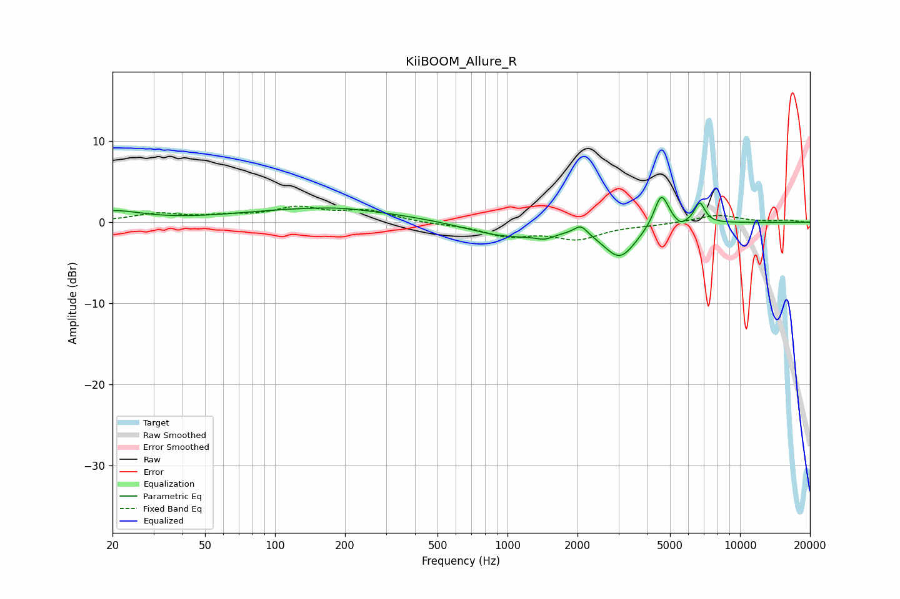

# KiiBOOM_Allure_R
See [usage instructions](https://github.com/jaakkopasanen/AutoEq#usage) for more options and info.

### Parametric EQs
Apply preamp of -3.2 dB when using parametric equalizer.

|   # | Type    |   Fc (Hz) |    Q |   Gain (dB) |
|-----|---------|-----------|------|-------------|
|   1 | Peaking |        20 | 1.15 |         1.3 |
|   2 | Peaking |       163 | 0.41 |         1.7 |
|   3 | Peaking |       187 | 2.04 |         0.1 |
|   4 | Peaking |       994 | 0.83 |        -1.8 |
|   5 | Peaking |      1445 | 3.44 |        -0.7 |
|   6 | Peaking |      2068 | 5.07 |         1.2 |
|   7 | Peaking |      3042 | 1.99 |        -4.1 |
|   8 | Peaking |      4588 | 4.49 |         4.2 |
|   9 | Peaking |      5550 | 6    |        -0.6 |
|  10 | Peaking |      6708 | 6    |         2.5 |

### Fixed Band EQs
When using fixed band (also called graphic) equalizer, apply preamp of **-2.1 dB** (if available) and set gains manually with these parameters.

|   # | Type    |   Fc (Hz) |    Q |   Gain (dB) |
|-----|---------|-----------|------|-------------|
|   1 | Peaking |        31 | 1.41 |         1   |
|   2 | Peaking |        62 | 1.41 |         0.6 |
|   3 | Peaking |       125 | 1.41 |         1.6 |
|   4 | Peaking |       250 | 1.41 |         1.3 |
|   5 | Peaking |       500 | 1.41 |        -0.2 |
|   6 | Peaking |      1000 | 1.41 |        -1.5 |
|   7 | Peaking |      2000 | 1.41 |        -1.9 |
|   8 | Peaking |      4000 | 1.41 |        -0.3 |
|   9 | Peaking |      8000 | 1.41 |         0.9 |
|  10 | Peaking |     16000 | 1.41 |         0.2 |

### Graphs

