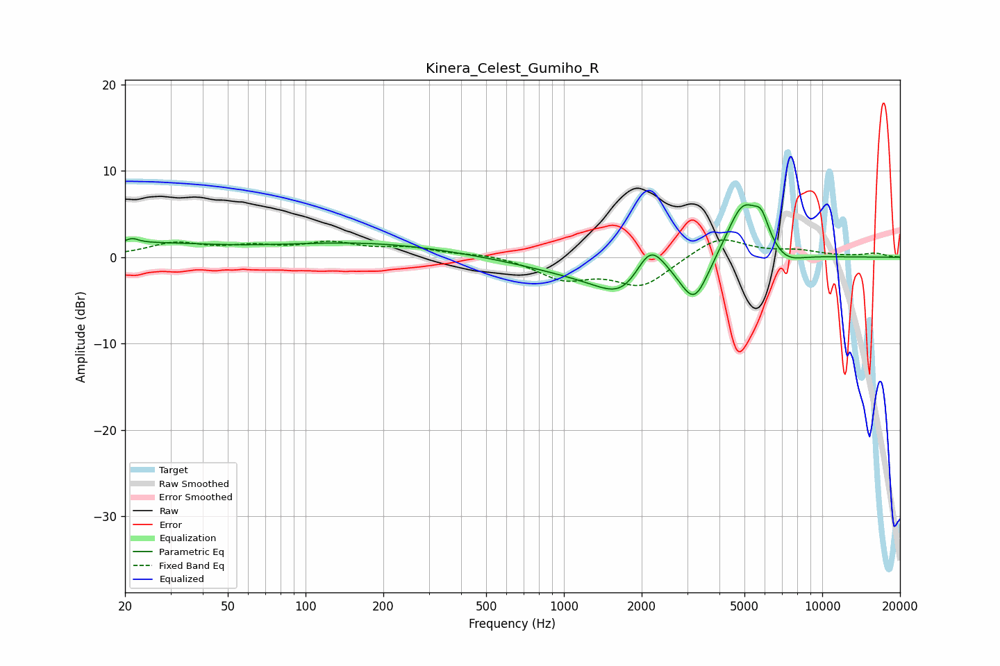

# Kinera_Celest_Gumiho_R
See [usage instructions](https://github.com/jaakkopasanen/AutoEq#usage) for more options and info.

### Parametric EQs
Apply preamp of -6.2 dB when using parametric equalizer.

|   # | Type    |   Fc (Hz) |    Q |   Gain (dB) |
|-----|---------|-----------|------|-------------|
|   1 | Peaking |        21 | 5.75 |         0.6 |
|   2 | Peaking |        23 | 0.5  |         1.5 |
|   3 | Peaking |       168 | 0.41 |         1.6 |
|   4 | Peaking |      1262 | 0.58 |        -1.8 |
|   5 | Peaking |      1715 | 1.43 |        -3.4 |
|   6 | Peaking |      2155 | 2.38 |         4.4 |
|   7 | Peaking |      3200 | 2.49 |        -5.2 |
|   8 | Peaking |      4935 | 2.07 |         6.7 |
|   9 | Peaking |      5821 | 4.77 |         2.6 |
|  10 | Peaking |      7204 | 2.1  |        -1.3 |

### Fixed Band EQs
When using fixed band (also called graphic) equalizer, apply preamp of **-2.1 dB** (if available) and set gains manually with these parameters.

|   # | Type    |   Fc (Hz) |    Q |   Gain (dB) |
|-----|---------|-----------|------|-------------|
|   1 | Peaking |        31 | 1.41 |         1.5 |
|   2 | Peaking |        62 | 1.41 |         1   |
|   3 | Peaking |       125 | 1.41 |         1.5 |
|   4 | Peaking |       250 | 1.41 |         0.9 |
|   5 | Peaking |       500 | 1.41 |         0.4 |
|   6 | Peaking |      1000 | 1.41 |        -2.4 |
|   7 | Peaking |      2000 | 1.41 |        -3.3 |
|   8 | Peaking |      4000 | 1.41 |         2.5 |
|   9 | Peaking |      8000 | 1.41 |         0.7 |
|  10 | Peaking |     16000 | 1.41 |         0.4 |

### Graphs

