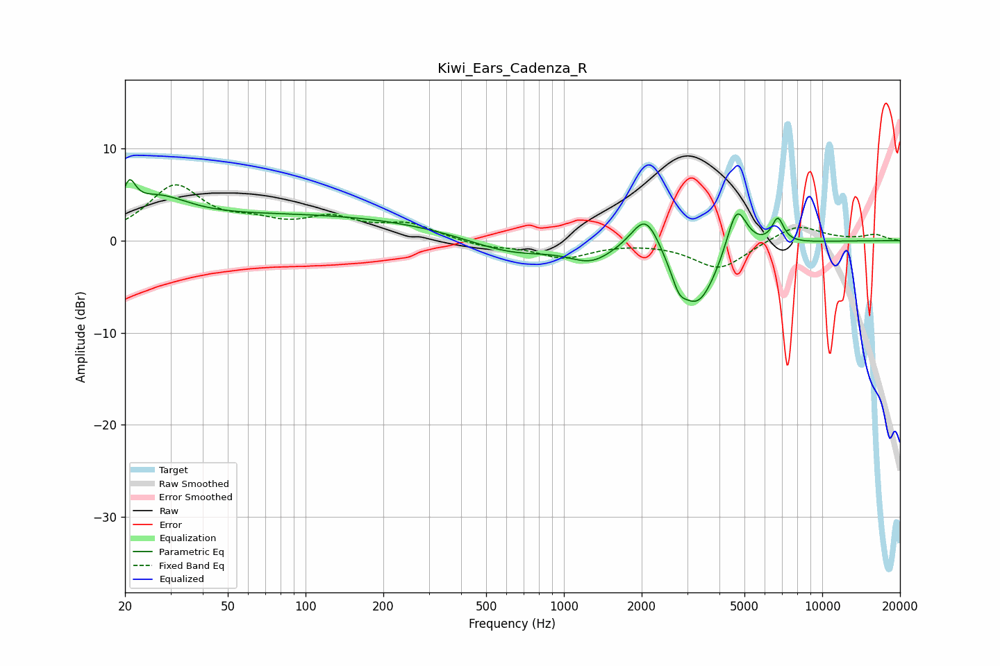

# Kiwi_Ears_Cadenza_R
See [usage instructions](https://github.com/jaakkopasanen/AutoEq#usage) for more options and info.

### Parametric EQs
Apply preamp of -6.7 dB when using parametric equalizer.

|   # | Type    |   Fc (Hz) |    Q |   Gain (dB) |
|-----|---------|-----------|------|-------------|
|   1 | Peaking |        21 | 6    |         3   |
|   2 | Peaking |        26 | 1.14 |         3.2 |
|   3 | Peaking |       100 | 0.26 |         2.7 |
|   4 | Peaking |       618 | 0.85 |        -1.7 |
|   5 | Peaking |      1275 | 1.64 |        -1.9 |
|   6 | Peaking |      2079 | 2.47 |         4.5 |
|   7 | Peaking |      2785 | 5.35 |        -1.7 |
|   8 | Peaking |      3281 | 1.66 |        -7.4 |
|   9 | Peaking |      4660 | 3.46 |         5.5 |
|  10 | Peaking |      6731 | 6    |         2.7 |

### Fixed Band EQs
When using fixed band (also called graphic) equalizer, apply preamp of **-6.1 dB** (if available) and set gains manually with these parameters.

|   # | Type    |   Fc (Hz) |    Q |   Gain (dB) |
|-----|---------|-----------|------|-------------|
|   1 | Peaking |        31 | 1.41 |         5.7 |
|   2 | Peaking |        62 | 1.41 |         1.4 |
|   3 | Peaking |       125 | 1.41 |         2.1 |
|   4 | Peaking |       250 | 1.41 |         1.6 |
|   5 | Peaking |       500 | 1.41 |        -0.7 |
|   6 | Peaking |      1000 | 1.41 |        -1.8 |
|   7 | Peaking |      2000 | 1.41 |        -0   |
|   8 | Peaking |      4000 | 1.41 |        -3.1 |
|   9 | Peaking |      8000 | 1.41 |         1.8 |
|  10 | Peaking |     16000 | 1.41 |         0.6 |

### Graphs

