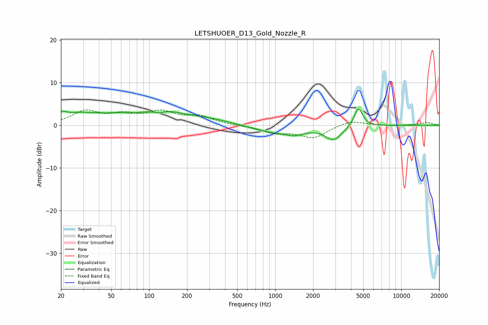

# LETSHUOER_D13_Gold_Nozzle_R
See [usage instructions](https://github.com/jaakkopasanen/AutoEq#usage) for more options and info.

### Parametric EQs
Apply preamp of -3.9 dB when using parametric equalizer.

|   # | Type    |   Fc (Hz) |    Q |   Gain (dB) |
|-----|---------|-----------|------|-------------|
|   1 | Peaking |        21 | 5.54 |         0.8 |
|   2 | Peaking |        28 | 0.64 |         2.7 |
|   3 | Peaking |        58 | 1.89 |         0.6 |
|   4 | Peaking |       119 | 2.73 |        -1.1 |
|   5 | Peaking |       120 | 0.97 |         3.1 |
|   6 | Peaking |       284 | 0.65 |         1.4 |
|   7 | Peaking |      1016 | 0.69 |        -1.8 |
|   8 | Peaking |      1418 | 2.17 |        -0.9 |
|   9 | Peaking |      2916 | 2.18 |        -3.1 |
|  10 | Peaking |      4570 | 4.23 |         4.5 |

### Fixed Band EQs
When using fixed band (also called graphic) equalizer, apply preamp of **-3.7 dB** (if available) and set gains manually with these parameters.

|   # | Type    |   Fc (Hz) |    Q |   Gain (dB) |
|-----|---------|-----------|------|-------------|
|   1 | Peaking |        31 | 1.41 |         3.1 |
|   2 | Peaking |        62 | 1.41 |         2.1 |
|   3 | Peaking |       125 | 1.41 |         2.8 |
|   4 | Peaking |       250 | 1.41 |         1.9 |
|   5 | Peaking |       500 | 1.41 |        -0.1 |
|   6 | Peaking |      1000 | 1.41 |        -1.6 |
|   7 | Peaking |      2000 | 1.41 |        -2.8 |
|   8 | Peaking |      4000 | 1.41 |         1.2 |
|   9 | Peaking |      8000 | 1.41 |        -0.2 |
|  10 | Peaking |     16000 | 1.41 |         0.7 |

### Graphs

