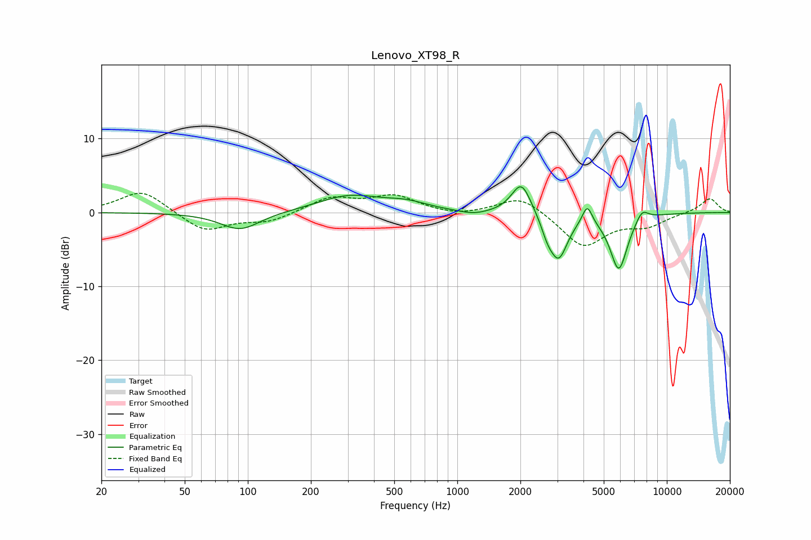

# Lenovo_XT98_R
See [usage instructions](https://github.com/jaakkopasanen/AutoEq#usage) for more options and info.

### Parametric EQs
Apply preamp of -3.6 dB when using parametric equalizer.

|   # | Type    |   Fc (Hz) |    Q |   Gain (dB) |
|-----|---------|-----------|------|-------------|
|   1 | Peaking |        92 | 1.5  |        -2.4 |
|   2 | Peaking |       305 | 0.95 |         2.2 |
|   3 | Peaking |       571 | 1.4  |         1   |
|   4 | Peaking |      1196 | 2.03 |        -0.5 |
|   5 | Peaking |      2023 | 3.02 |         4.4 |
|   6 | Peaking |      2694 | 4.79 |        -1.7 |
|   7 | Peaking |      3046 | 3.23 |        -5.9 |
|   8 | Peaking |      4170 | 6    |         2.6 |
|   9 | Peaking |      5898 | 3.26 |        -7.7 |
|  10 | Peaking |      7613 | 4.44 |         1.6 |

### Fixed Band EQs
When using fixed band (also called graphic) equalizer, apply preamp of **-2.7 dB** (if available) and set gains manually with these parameters.

|   # | Type    |   Fc (Hz) |    Q |   Gain (dB) |
|-----|---------|-----------|------|-------------|
|   1 | Peaking |        31 | 1.41 |         3.1 |
|   2 | Peaking |        62 | 1.41 |        -2.6 |
|   3 | Peaking |       125 | 1.41 |        -1.2 |
|   4 | Peaking |       250 | 1.41 |         2   |
|   5 | Peaking |       500 | 1.41 |         2.1 |
|   6 | Peaking |      1000 | 1.41 |        -0.5 |
|   7 | Peaking |      2000 | 1.41 |         2.4 |
|   8 | Peaking |      4000 | 1.41 |        -4.6 |
|   9 | Peaking |      8000 | 1.41 |        -1.6 |
|  10 | Peaking |     16000 | 1.41 |         2   |

### Graphs

