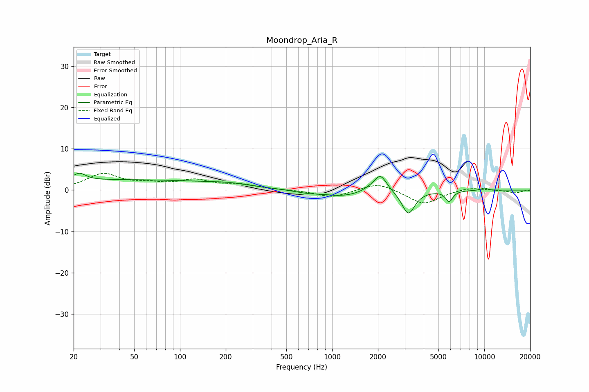

# Moondrop_Aria_R
See [usage instructions](https://github.com/jaakkopasanen/AutoEq#usage) for more options and info.

### Parametric EQs
Apply preamp of -4.2 dB when using parametric equalizer.

|   # | Type    |   Fc (Hz) |    Q |   Gain (dB) |
|-----|---------|-----------|------|-------------|
|   1 | Peaking |        22 | 3.49 |         1.8 |
|   2 | Peaking |        43 | 0.18 |         2.5 |
|   3 | Peaking |       209 | 1.28 |         0.5 |
|   4 | Peaking |       676 | 1.58 |        -0.6 |
|   5 | Peaking |      1172 | 1.09 |        -1.4 |
|   6 | Peaking |      1740 | 3.67 |         0.4 |
|   7 | Peaking |      2076 | 3.32 |         4.3 |
|   8 | Peaking |      3168 | 3.34 |        -5.8 |
|   9 | Peaking |      5876 | 6    |        -2.6 |
|  10 | Peaking |     10000 | 6    |         0.6 |

### Fixed Band EQs
When using fixed band (also called graphic) equalizer, apply preamp of **-4.2 dB** (if available) and set gains manually with these parameters.

|   # | Type    |   Fc (Hz) |    Q |   Gain (dB) |
|-----|---------|-----------|------|-------------|
|   1 | Peaking |        31 | 1.41 |         3.8 |
|   2 | Peaking |        62 | 1.41 |         1.2 |
|   3 | Peaking |       125 | 1.41 |         2.2 |
|   4 | Peaking |       250 | 1.41 |         1.2 |
|   5 | Peaking |       500 | 1.41 |         0   |
|   6 | Peaking |      1000 | 1.41 |        -1.8 |
|   7 | Peaking |      2000 | 1.41 |         2   |
|   8 | Peaking |      4000 | 1.41 |        -3.5 |
|   9 | Peaking |      8000 | 1.41 |         0.8 |
|  10 | Peaking |     16000 | 1.41 |        -0.7 |

### Graphs

