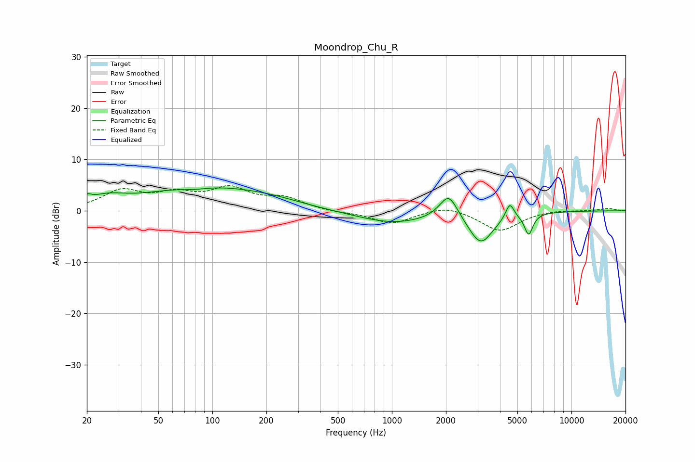

# Moondrop_Chu_R
See [usage instructions](https://github.com/jaakkopasanen/AutoEq#usage) for more options and info.

### Parametric EQs
Apply preamp of -4.5 dB when using parametric equalizer.

|   # | Type    |   Fc (Hz) |    Q |   Gain (dB) |
|-----|---------|-----------|------|-------------|
|   1 | Peaking |        20 | 5.82 |         1.1 |
|   2 | Peaking |        26 | 1.4  |         1.8 |
|   3 | Peaking |        79 | 1.54 |        -0.7 |
|   4 | Peaking |        83 | 0.48 |         4.5 |
|   5 | Peaking |       208 | 0.72 |         1.3 |
|   6 | Peaking |      1018 | 0.69 |        -2.4 |
|   7 | Peaking |      2071 | 2.76 |         5   |
|   8 | Peaking |      3122 | 2.03 |        -6.2 |
|   9 | Peaking |      4536 | 5.99 |         3.2 |
|  10 | Peaking |      5777 | 5.98 |        -4.1 |

### Fixed Band EQs
When using fixed band (also called graphic) equalizer, apply preamp of **-5.0 dB** (if available) and set gains manually with these parameters.

|   # | Type    |   Fc (Hz) |    Q |   Gain (dB) |
|-----|---------|-----------|------|-------------|
|   1 | Peaking |        31 | 1.41 |         3.6 |
|   2 | Peaking |        62 | 1.41 |         2.7 |
|   3 | Peaking |       125 | 1.41 |         3.9 |
|   4 | Peaking |       250 | 1.41 |         2.2 |
|   5 | Peaking |       500 | 1.41 |        -0.3 |
|   6 | Peaking |      1000 | 1.41 |        -2.5 |
|   7 | Peaking |      2000 | 1.41 |         1.2 |
|   8 | Peaking |      4000 | 1.41 |        -3.9 |
|   9 | Peaking |      8000 | 1.41 |         0.3 |
|  10 | Peaking |     16000 | 1.41 |         0.5 |

### Graphs

