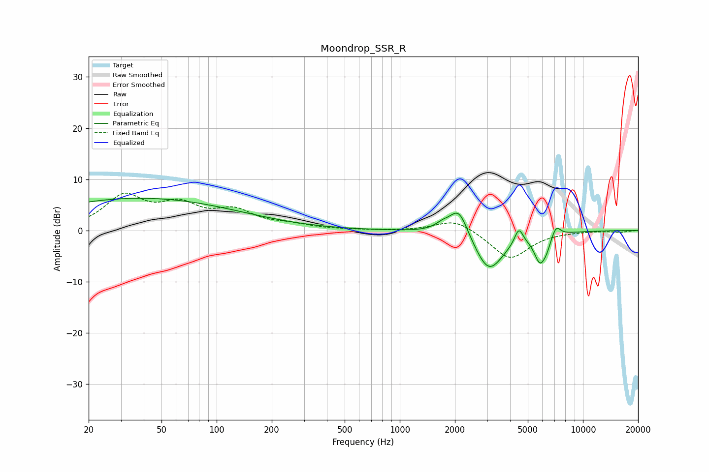

# Moondrop_SSR_R
See [usage instructions](https://github.com/jaakkopasanen/AutoEq#usage) for more options and info.

### Parametric EQs
Apply preamp of -6.4 dB when using parametric equalizer.

|   # | Type    |   Fc (Hz) |    Q |   Gain (dB) |
|-----|---------|-----------|------|-------------|
|   1 | Peaking |        38 | 0.25 |         6.3 |
|   2 | Peaking |      1758 | 3.16 |         1.7 |
|   3 | Peaking |      1823 | 4.7  |        -0.5 |
|   4 | Peaking |      2105 | 2.73 |         5.6 |
|   5 | Peaking |      3061 | 1.69 |        -8.2 |
|   6 | Peaking |      4466 | 5.95 |         3.2 |
|   7 | Peaking |      5814 | 4.47 |        -5   |
|   8 | Peaking |      6296 | 6    |        -1.3 |
|   9 | Peaking |      6376 | 5.68 |        -0.5 |
|  10 | Peaking |      7136 | 5.56 |         2.2 |

### Fixed Band EQs
When using fixed band (also called graphic) equalizer, apply preamp of **-7.4 dB** (if available) and set gains manually with these parameters.

|   # | Type    |   Fc (Hz) |    Q |   Gain (dB) |
|-----|---------|-----------|------|-------------|
|   1 | Peaking |        31 | 1.41 |         6.3 |
|   2 | Peaking |        62 | 1.41 |         4.3 |
|   3 | Peaking |       125 | 1.41 |         3.4 |
|   4 | Peaking |       250 | 1.41 |         0.9 |
|   5 | Peaking |       500 | 1.41 |         0.1 |
|   6 | Peaking |      1000 | 1.41 |        -0.1 |
|   7 | Peaking |      2000 | 1.41 |         2.4 |
|   8 | Peaking |      4000 | 1.41 |        -5.6 |
|   9 | Peaking |      8000 | 1.41 |        -0.1 |
|  10 | Peaking |     16000 | 1.41 |        -0.3 |

### Graphs

