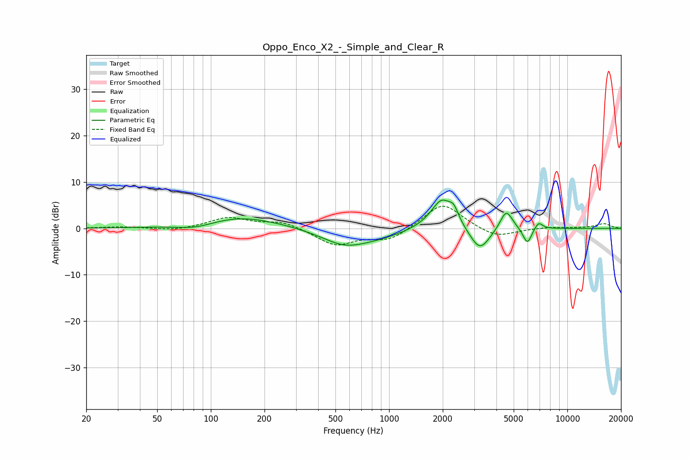

# Oppo_Enco_X2_-_Simple_and_Clear_R
See [usage instructions](https://github.com/jaakkopasanen/AutoEq#usage) for more options and info.

### Parametric EQs
Apply preamp of -6.2 dB when using parametric equalizer.

|   # | Type    |   Fc (Hz) |    Q |   Gain (dB) |
|-----|---------|-----------|------|-------------|
|   1 | Peaking |        83 | 1.24 |        -1.4 |
|   2 | Peaking |       141 | 0.62 |         2.7 |
|   3 | Peaking |       567 | 1.05 |        -3.6 |
|   4 | Peaking |       908 | 1.07 |        -1.1 |
|   5 | Peaking |      1974 | 2.27 |         6.6 |
|   6 | Peaking |      2309 | 5.33 |         2.4 |
|   7 | Peaking |      3230 | 2.49 |        -5.2 |
|   8 | Peaking |      4544 | 4    |         4.4 |
|   9 | Peaking |      5965 | 5.64 |        -3.5 |
|  10 | Peaking |      6894 | 6    |         1.6 |

### Fixed Band EQs
When using fixed band (also called graphic) equalizer, apply preamp of **-4.9 dB** (if available) and set gains manually with these parameters.

|   # | Type    |   Fc (Hz) |    Q |   Gain (dB) |
|-----|---------|-----------|------|-------------|
|   1 | Peaking |        31 | 1.41 |         0.3 |
|   2 | Peaking |        62 | 1.41 |        -0.5 |
|   3 | Peaking |       125 | 1.41 |         2.3 |
|   4 | Peaking |       250 | 1.41 |         1.5 |
|   5 | Peaking |       500 | 1.41 |        -3.6 |
|   6 | Peaking |      1000 | 1.41 |        -2.6 |
|   7 | Peaking |      2000 | 1.41 |         5.7 |
|   8 | Peaking |      4000 | 1.41 |        -2.2 |
|   9 | Peaking |      8000 | 1.41 |         0.3 |
|  10 | Peaking |     16000 | 1.41 |         1   |

### Graphs

