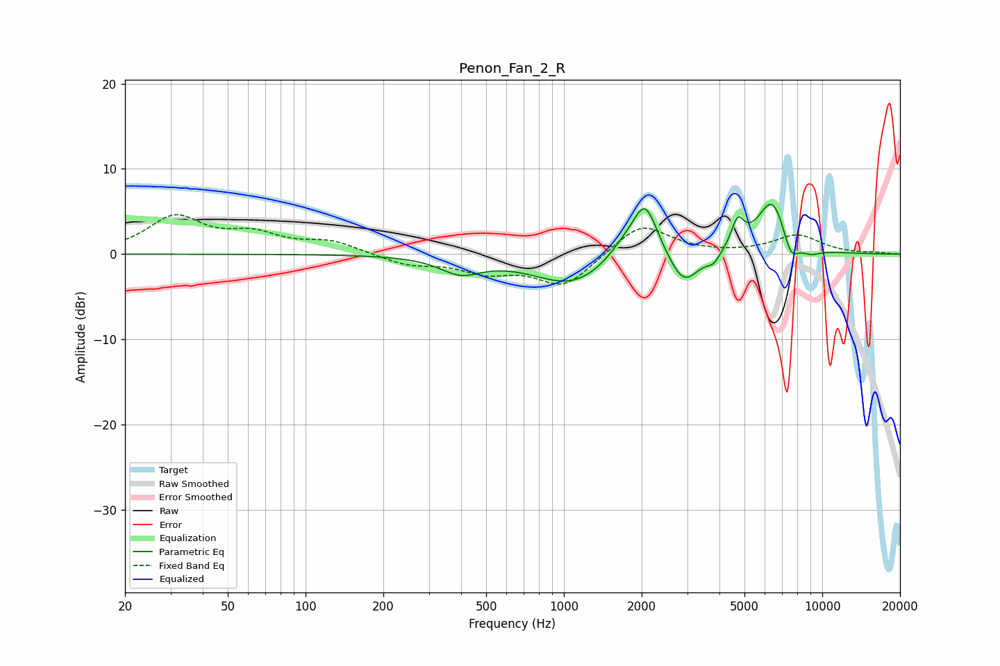

# Penon_Fan_2_R
See [usage instructions](https://github.com/jaakkopasanen/AutoEq#usage) for more options and info.

### Parametric EQs
Apply preamp of -5.9 dB when using parametric equalizer.

|   # | Type    |   Fc (Hz) |    Q |   Gain (dB) |
|-----|---------|-----------|------|-------------|
|   1 | Peaking |       398 | 1.78 |        -1.9 |
|   2 | Peaking |      1074 | 0.95 |        -3.6 |
|   3 | Peaking |      1685 | 2.21 |         1.5 |
|   4 | Peaking |      2061 | 2.78 |         6.6 |
|   5 | Peaking |      2913 | 2.43 |        -3.9 |
|   6 | Peaking |      3798 | 5.51 |        -1.1 |
|   7 | Peaking |      4706 | 5.71 |         3.2 |
|   8 | Peaking |      6417 | 2.28 |         6.7 |
|   9 | Peaking |      7547 | 4.32 |        -3   |
|  10 | Peaking |      8980 | 3.13 |        -0.8 |

### Fixed Band EQs
When using fixed band (also called graphic) equalizer, apply preamp of **-4.7 dB** (if available) and set gains manually with these parameters.

|   # | Type    |   Fc (Hz) |    Q |   Gain (dB) |
|-----|---------|-----------|------|-------------|
|   1 | Peaking |        31 | 1.41 |         4.2 |
|   2 | Peaking |        62 | 1.41 |         2   |
|   3 | Peaking |       125 | 1.41 |         1.4 |
|   4 | Peaking |       250 | 1.41 |        -1.2 |
|   5 | Peaking |       500 | 1.41 |        -1.9 |
|   6 | Peaking |      1000 | 1.41 |        -3.8 |
|   7 | Peaking |      2000 | 1.41 |         3.7 |
|   8 | Peaking |      4000 | 1.41 |        -0   |
|   9 | Peaking |      8000 | 1.41 |         2.2 |
|  10 | Peaking |     16000 | 1.41 |         0.1 |

### Graphs

