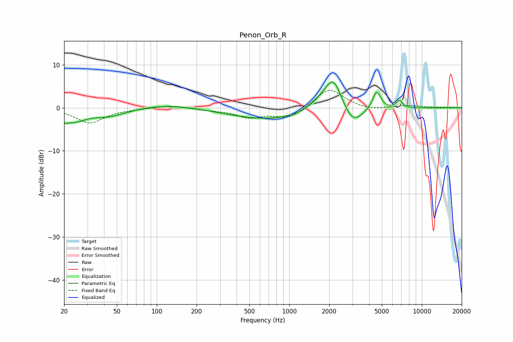

# Penon_Orb_R
See [usage instructions](https://github.com/jaakkopasanen/AutoEq#usage) for more options and info.

### Parametric EQs
Apply preamp of -6.0 dB when using parametric equalizer.

|   # | Type    |   Fc (Hz) |    Q |   Gain (dB) |
|-----|---------|-----------|------|-------------|
|   1 | Peaking |        20 | 4.63 |        -1.5 |
|   2 | Peaking |        24 | 1.81 |        -2.3 |
|   3 | Peaking |        43 | 0.95 |        -2.1 |
|   4 | Peaking |       114 | 0.51 |         1   |
|   5 | Peaking |       718 | 0.43 |        -2.8 |
|   6 | Peaking |      1739 | 1.64 |         1.7 |
|   7 | Peaking |      2160 | 2.12 |         7.5 |
|   8 | Peaking |      3004 | 1.87 |        -4.4 |
|   9 | Peaking |      4560 | 4.53 |         4.3 |
|  10 | Peaking |      6769 | 6    |         1.7 |

### Fixed Band EQs
When using fixed band (also called graphic) equalizer, apply preamp of **-4.2 dB** (if available) and set gains manually with these parameters.

|   # | Type    |   Fc (Hz) |    Q |   Gain (dB) |
|-----|---------|-----------|------|-------------|
|   1 | Peaking |        31 | 1.41 |        -3.5 |
|   2 | Peaking |        62 | 1.41 |        -0.2 |
|   3 | Peaking |       125 | 1.41 |         0.7 |
|   4 | Peaking |       250 | 1.41 |        -0.4 |
|   5 | Peaking |       500 | 1.41 |        -2.1 |
|   6 | Peaking |      1000 | 1.41 |        -2.5 |
|   7 | Peaking |      2000 | 1.41 |         4.7 |
|   8 | Peaking |      4000 | 1.41 |        -0.7 |
|   9 | Peaking |      8000 | 1.41 |         0.5 |
|  10 | Peaking |     16000 | 1.41 |         0.1 |

### Graphs

