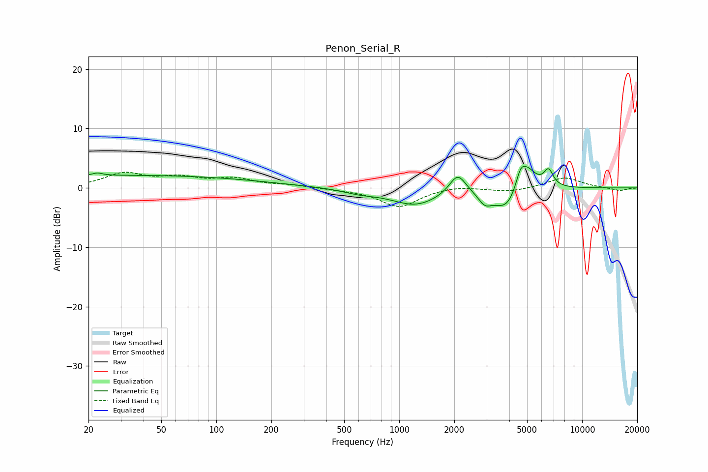

# Penon_Serial_R
See [usage instructions](https://github.com/jaakkopasanen/AutoEq#usage) for more options and info.

### Parametric EQs
Apply preamp of -3.7 dB when using parametric equalizer.

|   # | Type    |   Fc (Hz) |    Q |   Gain (dB) |
|-----|---------|-----------|------|-------------|
|   1 | Peaking |        22 | 5.05 |         0.5 |
|   2 | Peaking |        35 | 0.18 |         2.1 |
|   3 | Peaking |       605 | 1.53 |        -0.6 |
|   4 | Peaking |      1229 | 1.06 |        -2.8 |
|   5 | Peaking |      2087 | 3.08 |         3.5 |
|   6 | Peaking |      2937 | 3.88 |        -1.8 |
|   7 | Peaking |      3878 | 1.96 |        -4   |
|   8 | Peaking |      4596 | 5.69 |         2.3 |
|   9 | Peaking |      4959 | 2.65 |         4.2 |
|  10 | Peaking |      6551 | 5.39 |         2.7 |

### Fixed Band EQs
When using fixed band (also called graphic) equalizer, apply preamp of **-2.7 dB** (if available) and set gains manually with these parameters.

|   # | Type    |   Fc (Hz) |    Q |   Gain (dB) |
|-----|---------|-----------|------|-------------|
|   1 | Peaking |        31 | 1.41 |         2.3 |
|   2 | Peaking |        62 | 1.41 |         1.5 |
|   3 | Peaking |       125 | 1.41 |         1.4 |
|   4 | Peaking |       250 | 1.41 |         0.4 |
|   5 | Peaking |       500 | 1.41 |        -0.2 |
|   6 | Peaking |      1000 | 1.41 |        -3.2 |
|   7 | Peaking |      2000 | 1.41 |         0.4 |
|   8 | Peaking |      4000 | 1.41 |        -0.7 |
|   9 | Peaking |      8000 | 1.41 |         1.8 |
|  10 | Peaking |     16000 | 1.41 |        -0.5 |

### Graphs

