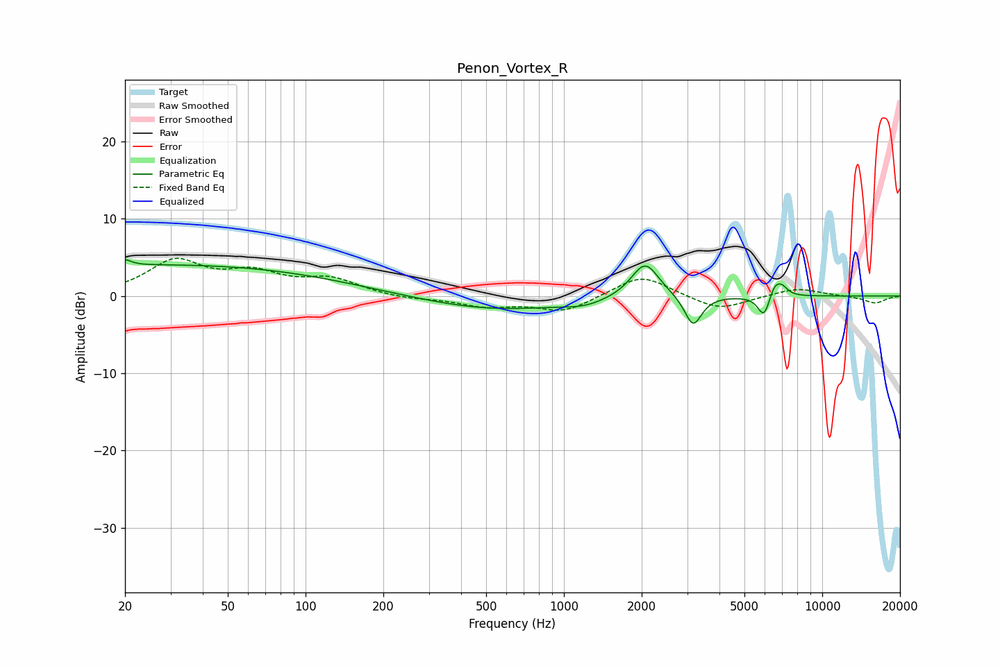

# Penon_Vortex_R
See [usage instructions](https://github.com/jaakkopasanen/AutoEq#usage) for more options and info.

### Parametric EQs
Apply preamp of -4.8 dB when using parametric equalizer.

|   # | Type    |   Fc (Hz) |    Q |   Gain (dB) |
|-----|---------|-----------|------|-------------|
|   1 | Peaking |        20 | 6    |         0.8 |
|   2 | Peaking |        29 | 0.19 |         4   |
|   3 | Peaking |       533 | 0.5  |        -1.9 |
|   4 | Peaking |      1198 | 1.81 |        -0.7 |
|   5 | Peaking |      2022 | 2.44 |         0.5 |
|   6 | Peaking |      2067 | 2.65 |         4.1 |
|   7 | Peaking |      3164 | 4.3  |        -4   |
|   8 | Peaking |      5956 | 5.83 |        -3   |
|   9 | Peaking |      6542 | 5.71 |         1.8 |
|  10 | Peaking |      6997 | 5.97 |         1   |

### Fixed Band EQs
When using fixed band (also called graphic) equalizer, apply preamp of **-5.0 dB** (if available) and set gains manually with these parameters.

|   # | Type    |   Fc (Hz) |    Q |   Gain (dB) |
|-----|---------|-----------|------|-------------|
|   1 | Peaking |        31 | 1.41 |         4.3 |
|   2 | Peaking |        62 | 1.41 |         2.5 |
|   3 | Peaking |       125 | 1.41 |         2   |
|   4 | Peaking |       250 | 1.41 |        -0.4 |
|   5 | Peaking |       500 | 1.41 |        -1.3 |
|   6 | Peaking |      1000 | 1.41 |        -2   |
|   7 | Peaking |      2000 | 1.41 |         2.9 |
|   8 | Peaking |      4000 | 1.41 |        -1.9 |
|   9 | Peaking |      8000 | 1.41 |         1.1 |
|  10 | Peaking |     16000 | 1.41 |        -0.9 |

### Graphs

