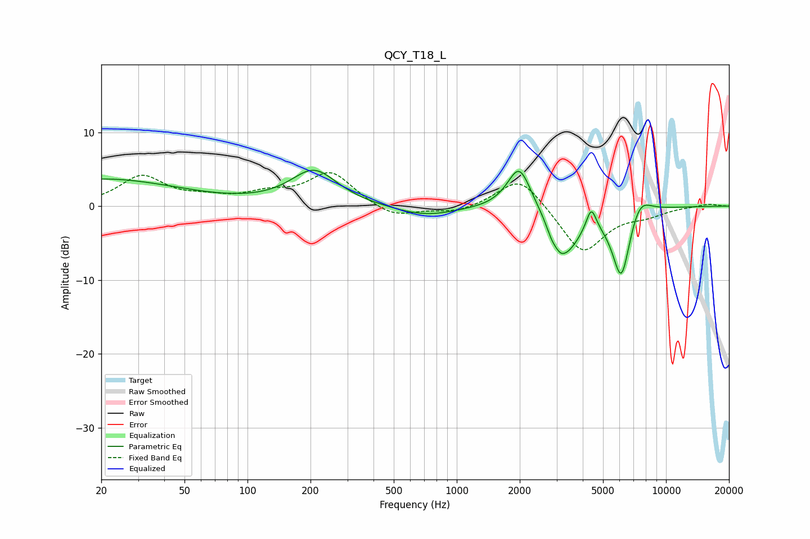

# QCY_T18_L
See [usage instructions](https://github.com/jaakkopasanen/AutoEq#usage) for more options and info.

### Parametric EQs
Apply preamp of -4.9 dB when using parametric equalizer.

|   # | Type    |   Fc (Hz) |    Q |   Gain (dB) |
|-----|---------|-----------|------|-------------|
|   1 | Peaking |        20 | 0.38 |         3.6 |
|   2 | Peaking |       208 | 1.27 |         4.8 |
|   3 | Peaking |       703 | 0.94 |        -1.4 |
|   4 | Peaking |      1989 | 2.48 |         6.1 |
|   5 | Peaking |      2841 | 5.44 |        -1.2 |
|   6 | Peaking |      3118 | 5.61 |        -1   |
|   7 | Peaking |      3338 | 1.98 |        -5.8 |
|   8 | Peaking |      4393 | 5.95 |         3.1 |
|   9 | Peaking |      6118 | 3.04 |       -10   |
|  10 | Peaking |      7428 | 2.45 |         3.1 |

### Fixed Band EQs
When using fixed band (also called graphic) equalizer, apply preamp of **-4.6 dB** (if available) and set gains manually with these parameters.

|   # | Type    |   Fc (Hz) |    Q |   Gain (dB) |
|-----|---------|-----------|------|-------------|
|   1 | Peaking |        31 | 1.41 |         3.9 |
|   2 | Peaking |        62 | 1.41 |         0.8 |
|   3 | Peaking |       125 | 1.41 |         1.4 |
|   4 | Peaking |       250 | 1.41 |         4.5 |
|   5 | Peaking |       500 | 1.41 |        -1.7 |
|   6 | Peaking |      1000 | 1.41 |        -0.9 |
|   7 | Peaking |      2000 | 1.41 |         4.3 |
|   8 | Peaking |      4000 | 1.41 |        -6.5 |
|   9 | Peaking |      8000 | 1.41 |        -1   |
|  10 | Peaking |     16000 | 1.41 |         0.3 |

### Graphs

